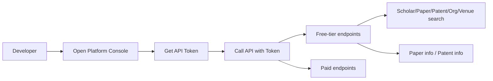

# AMiner Open Platform Free-Tier API Overview

Based on [AMiner Open Platform docs](https://www.aminer.cn/open/docs?id=671a19a46e728a29db292f73) and [Data API list](https://open.aminer.cn/open/docs).

## 1. Free-Tier API List

The platform marks some endpoints as "free-tier", i.e. callable for free within certain quotas or conditions.

### 1.1 Data Query (Free-Tier)

| API Name       | Description                    |
|----------------|--------------------------------|
| Scholar search | Search scholars by criteria    |
| Paper search   | Search papers by criteria       |
| Patent search  | Search patents by criteria     |
| Organization search | Search organizations by criteria |
| Venue search   | Search venues/journals by criteria |

### 1.2 Data Retrieval (Free-Tier)

| API Name   | Description                              |
|------------|------------------------------------------|
| Paper info | Get paper details by paper ID, etc.      |
| Patent info| Get patent details by patent ID, etc.    |

> Note: "Paper detail" and "Patent detail" are paid endpoints (see below); they are different from the free-tier "Paper info" and "Patent info".

---

## 2. General Conventions

- **Authentication**: Log in at [AMiner Open Platform](https://open.aminer.cn/), obtain an API key in the **Console**, generate a **Token**, and send it with each request.
- **Headers** (typical; follow console docs):
  - `Authorization: <TOKEN>` or `Authorization: Bearer <TOKEN>`
  - Optional: `Content-Type: application/json` (for POST)
- **Base URL**: Public examples use `https://datacenter.aminer.cn/gateway/open_platform/`; actual paths follow the console documentation.
- **Docs and quotas**: [https://open.aminer.cn/docs](https://open.aminer.cn/docs) / [Console](https://open.aminer.cn/open/board?tab=control); free-tier limits and QPS are defined in the console.
- **MCP integration**: Model Context Protocol one-click integration is supported; see [MCP docs](https://zhipu-ai.feishu.cn/wiki/VHAGwiboFivCztkqknSciiQjn4d?from=from_aminer) (login may be required).

---

## 3. Free-Tier API Call Details

Below are all seven free-tier endpoints, grouped as "Data query" and "Data retrieval", with request URL, method, parameters, and response fields as in the official docs; quotas and QPS follow the **open.aminer.cn console**.

### 3.1 Data Query (Free-Tier)

#### Paper search (free-tier)

- **Doc updated**: 2025-11-19
- **Purpose**: Get paper title, ID, DOI by title. Free.
- **URL**: `https://datacenter.aminer.cn/gateway/open_platform/api/paper/search`
- **Method**: `GET`
- **Header**: `Authorization`: Token generated from console Key (see usage docs)
- **Query parameters**:

| Param  | Type   | Required | Description           | Example                               | Max/Length |
|--------|--------|----------|-----------------------|---------------------------------------|------------|
| page   | number | yes      | Page number (0-based) | 1                                     | 0          |
| size   | number | no       | Page size             | 10                                    | 20         |
| title  | string | yes      | Title                 | Looking at CTR Prediction Again: ... | -          |

- **Response data (JSON)**: `doi`, `id`, `title`, `title_zh`, `total`.

#### Scholar search (free-tier)

- **Doc updated**: 2025-11-19
- **Purpose**: Search scholars by name; returns scholar ID, name, organization. Free.
- **URL**: `https://datacenter.aminer.cn/gateway/open_platform/api/person/search`
- **Method**: `POST`
- **Headers**:
  - `Content-Type`: `application/json;charset=utf-8`
  - `Authorization`: Token from console Key (see usage docs)
- **Body (JSON)**:

| Param  | Type     | Required | Description     | Example            | Max/Length |
|--------|----------|----------|-----------------|--------------------|------------|
| name   | string   | no       | Scholar name    | (example)          | -          |
| offset | number   | no       | Start offset    | 0                  | 0          |
| org    | string   | no       | Organization    | Shanghai Jiaotong  | -          |
| size   | number   | no       | Page size       | 10                 | 10         |
| org_id | []string | no       | Organization IDs| -                  | -          |

- **Response data (JSON)**: `id`, `interests`, `n_citation`, `name`, `name_zh`, `org`, `org_id`, `org_zh`, `total`.

#### Patent search (free-tier)

- **Doc updated**: 2025-11-10
- **Purpose**: Search patents by name; returns patent ID, title, patent number. Free.
- **URL**: `https://datacenter.aminer.cn/gateway/open_platform/api/patent/search`
- **Method**: `POST`
- **Headers**:
  - `Content-Type`: `application/json;charset=utf-8`
  - `Authorization`: Token from console Key (see usage docs)
- **Body (JSON)**:

| Param  | Type   | Required | Description (title, keywords, etc.) | Example | Max/Length |
|--------|--------|----------|-------------------------------------|---------|------------|
| query  | string | yes      | Query text                          | Si02    | -          |
| page   | number | yes      | Page number                         | 0       | -          |
| size   | number | yes      | Page size                           | 20      | -          |

- **Response data (JSON)**: `id`, `title`, `title_zh`, `total`.

#### Organization search (free-tier)

- **Doc updated**: 2025-07-24
- **Purpose**: Search organizations by name keyword; returns org ID and name. Free.
- **URL**: `https://datacenter.aminer.cn/gateway/open_platform/api/organization/search`
- **Method**: `POST`
- **Headers**:
  - `Content-Type`: `application/json;charset=utf-8`
  - `Authorization`: Token from console Key (see usage docs)
- **Body (JSON)**:

| Param | Type     | Required | Description      | Example   |
|-------|----------|----------|------------------|-----------|
| orgs  | []string | no       | Organization names | (e.g. Tsinghua) |

- **Response data (JSON)**: `code`, `message`, `org_id`, `org_name`, `success`, `total`.

#### Venue search (free-tier)

- **Doc updated**: 2024-11-25
- **Purpose**: Search venues by name; returns venue ID and standard name. Free.
- **URL**: `https://datacenter.aminer.cn/gateway/open_platform/api/venue/search`
- **Method**: `POST`
- **Headers**:
  - `Content-Type`: `application/json;charset=utf-8`
  - `Authorization`: Token from console Key (see usage docs)
- **Body (JSON)**:

| Param | Type   | Required | Description | Example     |
|-------|--------|----------|-------------|-------------|
| name  | string | no       | Venue name  | The Lancet  |

- **Response data (JSON)**: `id`, `name_en`, `name_zh`, `total`.

### 3.2 Data Retrieval (Free-Tier)

#### Paper info (free-tier)

- **Doc updated**: 2023-10-13
- **Purpose**: Get title, volume, venue name, authors by paper ID. Free.
- **URL**: `https://datacenter.aminer.cn/gateway/open_platform/api/paper/info`
- **Method**: `POST`
- **Headers**:
  - `Content-Type`: `application/json;charset=utf-8`
  - `Authorization`: Token from console Key (see usage docs)
- **Body (JSON)**:

| Param | Type     | Required | Description   | Example                   | Max/Length |
|-------|----------|----------|---------------|---------------------------|------------|
| ids   | []string | yes      | Paper ID list | 5ce2c5a5ced107d4c61c839b | 100        |

- **Response data (JSON)**: `_id`, `authors` (name, name_zh), `issue`, `name`, `raw` (venue name), `title`, `venue`.

#### Patent info (free-tier)

- **Doc updated**: 2023-10-13
- **Purpose**: Get patent title, number, inventors, country by patent ID. Free.
- **URL**: `https://datacenter.aminer.cn/gateway/open_platform/api/patent/info`
- **Method**: `GET`
- **Header**: `Authorization`: Token from console Key (see usage docs)
- **Query parameters**:

| Param | Type   | Required | Description | Example                   |
|-------|--------|----------|-------------|---------------------------|
| id    | string | yes      | Patent ID   | 63370927667297566c3fb14f |

- **Response data (JSON)**: `app_num`, `country`, `en`, `id`, `inventor`, `name`, `pub_kind`, `pub_num`, `sequence`, `title`.

### 3.3 Summary Table

| Type       | API name      | Method | Typical params                                      |
|------------|---------------|--------|-----------------------------------------------------|
| Query      | Paper search  | GET    | title (required), page (required), size (max 20)    |
| Query      | Scholar search| POST   | name, org, offset, size (max 10), org_id            |
| Query      | Patent search | POST   | query (required), page (required), size (required)  |
| Query      | Organization search | POST | orgs (optional)                              |
| Query      | Venue search  | POST   | name (optional)                                     |
| Retrieval  | Paper info    | POST   | ids (required, max 100)                            |
| Retrieval  | Patent info   | GET    | id (required)                                      |

Request URLs, parameters, and response fields for all seven free-tier endpoints are as in sections 3.1 and 3.2; quotas and QPS are defined in the **open.aminer.cn console**.

---

## 4. Comparison with Paid APIs (Reference)

The following are **paid** endpoints and approximate unit prices (actual prices in console):

| Endpoint           | Approx. price | Description                          |
|--------------------|---------------|--------------------------------------|
| Paper detail       | 0.01 CNY/call | Title, authors, DOI, org, venue, etc.|
| Patent detail      | 0.01 CNY/call | Abstract, filing date, applicant, country, etc. |
| Organization detail| 0.01 CNY/call | Aliases, founding date, intro, type, etc. |
| Paper citations    | 0.1 CNY/call  | Citing paper IDs, titles, etc.       |
| Scholar profile    | 0.5 CNY/call  | Interests, domain, experience, etc.  |
| Scholar detail     | 1 CNY/call    | Scholar ID, name, org, etc.          |
| Paper search pro   | -             | Advanced paper search                |
| Org disambiguation / pro | -       | Organization name disambiguation     |

Free-tier endpoints focus on "search" and "basic info"; paid endpoints focus on "detail, citations, profile" and deeper data.

---

## 5. Platform Data Scale (Reference)

- Papers: 300M+
- Patents: 160M+
- Scholars: 68M+
- Grants: 6M+
- Venues/conferences: 100K+

---

## 6. Summary

| Type       | Free-tier count | Typical use                                      |
|------------|-----------------|--------------------------------------------------|
| Data query | 5               | Scholar / paper / patent / org / venue search    |
| Data retrieval | 2            | Paper info, patent info                          |

Quotas, QPS, and daily limits are defined in the **open.aminer.cn console**; token generation and usage follow the console documentation.
