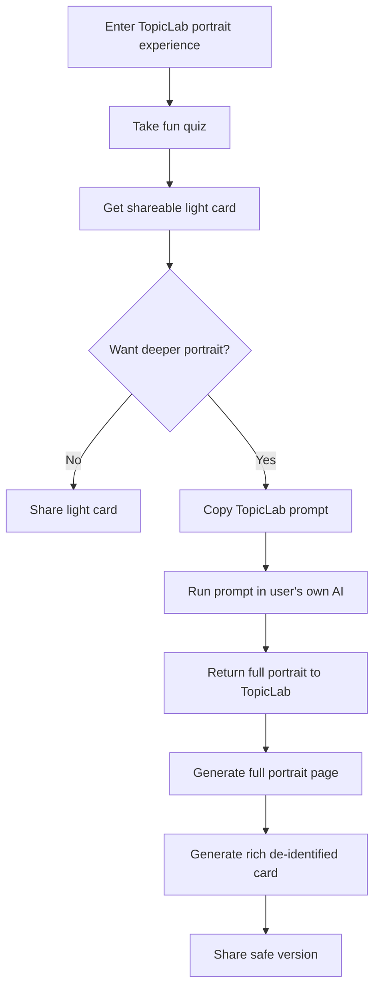

# Fun Quiz, Full Portrait, and Share Card Stack

## 1. Why This Exists

TopicLab already has a serious portrait pipeline: chat collection, scales, structured profile rendering, and digital-twin publishing.

That pipeline is useful, but it is not the best first-touch experience for growth or sharing. A lighter and more playful layer is needed before the full portrait flow.

The product direction is therefore:

- let users enter through a fun, low-pressure quiz
- return a strong first result that feels shareable
- give interested users a path into a much deeper portrait
- provide a richer card that is still safe to share publicly

This is a layered funnel, not a single card design problem.

## 2. Product Layers

### 2.1 Light Quiz

Goal:

- low-friction entry
- fun completion experience
- high willingness to share

Characteristics:

- 20-40 questions
- playful wording and memorable choices
- original TopicLab type system instead of directly naming a real scientist as the main type
- result card optimized for social sharing

Outputs:

- original research-persona type
- one strong subtitle
- 3-5 short descriptive lines
- optional historical scientist references in detail view

### 2.2 Full Portrait

Goal:

- generate a much richer research profile than the light quiz can produce
- preserve user trust and reduce direct privacy pressure

Characteristics:

- user receives a TopicLab prompt
- user pastes the prompt into their own AI
- the resulting content is brought back into TopicLab
- TopicLab parses or displays a full portrait similar to the current Profile Helper output

Outputs:

- full portrait text
- structured profile
- optional digital-twin publication path

### 2.3 Rich De-identified Card

Goal:

- sit between the light quiz card and the full private portrait
- preserve substance without exposing identity-sensitive details

Characteristics:

- more informative than the light card
- suitable for homepage/profile/community sharing
- derived from the full portrait, but filtered by de-identification rules

Outputs:

- richer summary card
- abstracted research style, motivation, collaboration, and path information
- no direct identifiers

## 3. Recommended User Journey

## 4. Information Architecture

### 4.1 Light Card

The light card should contain:

- original type name
- short subtitle
- one visual hero area
- 3-5 short lines of description
- one strong share caption

The light card should avoid:

- real name
- institution
- detailed research direction
- long paragraphs
- private reflection content

### 4.2 Full Portrait

The full portrait can contain:

- name
- research stage
- field and method
- capability profile
- needs and pain points
- cognitive style
- academic motivation
- personality dimensions
- development path
- digital-twin publication controls

This layer remains default-private.

### 4.3 Rich De-identified Card

The rich card should contain:

- original type name
- high-level field tag only
- cognitive style summary
- motivation style summary
- collaboration style summary
- suitable development path
- optional historical scientist references

The rich card should avoid:

- real name
- school, lab, mentor, or employer
- exact project or unpublished work
- detailed pain points that expose personal vulnerability
- any combination of details that allows easy re-identification

## 5. Product Rule: Original Type First, Scientist Reference Second

The core shareable identity should be TopicLab's own type system.

Reason:

- the card needs a stable branded vocabulary
- using real scientists as the main type increases legal and product risk
- the result should feel inspired by science culture, not dependent on a single public figure

Recommended structure:

- main result: original type
- secondary detail: `historical scientist references`

Bad pattern:

- making the main share title equal to a real scientist's name

Better pattern:

- `你是“系统归纳者”`
- detail area: `历史科学人物参考：冯·诺依曼 / 波尔 / 居里夫人`

## 6. Fit With Current TopicLab Architecture

This direction can reuse the current stack instead of replacing it.

Recommended positioning:

- `Light quiz` becomes a new lightweight entry surface before or beside the current `Profile Helper`
- `Full portrait` can continue to land in the current `/profile-helper/profile` style rendering path
- `Rich de-identified card` becomes a new share surface derived from the full portrait

This means TopicLab does not need to throw away its current structured profile system. The new playful layer should feed the existing serious layer.

## 7. Suggested Implementation Sequence

### Phase 1

- define the original type taxonomy
- define the light quiz dimensions
- ship the light share card

### Phase 2

- define the prompt contract for user-owned AI
- define the import/parsing path for full portraits
- reuse the current full portrait page

### Phase 3

- define de-identification rules
- ship the rich de-identified card
- add explicit private/shareable state labels

### Phase 4

- add historical scientist references
- add reference explanations and safe image/text rules

## 8. Open Design Questions

- Should the light quiz and the full portrait use the same dimension system, or only partially overlap?
- Should the rich de-identified card be generated deterministically from structured fields, or partially rewritten for readability?
- Should scientist references appear on the first card at all, or only on the detail page behind an expand action?
- Should the share surface expose one historical scientist or a ranked list of references?

## 9. Current Decision Summary

Current recommended direction:

- yes to `fun quiz`
- yes to `shareable light card`
- yes to `full portrait via user-owned AI prompt`
- yes to `richer de-identified share card`
- no to making a real scientist the primary result identity
- no to assuming that a deceased scientist automatically creates no legal risk
