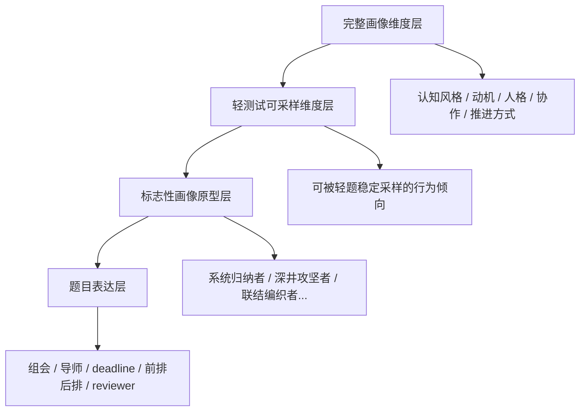

# 轻测试设计骨架：从无厘头题面到标志性画像

## 1. 文档目标

本文回答一个核心问题：

如何让一套看起来轻松、好玩、甚至有点“无厘头”的科研生活题，
在底层仍然能够：

1. 覆盖完整画像的关键维度
2. 稳定形成若干“标志性画像”
3. 与完整画像系统建立可解释的映射关系

本文不是题库文档，而是轻测试的上层设计骨架。

---

## 2. 一句话原则

轻测试要做到：

- `题面轻`
- `计算稳`
- `结果真`

也就是：

- 用户感受到的是“科研生活吐槽题”
- 系统内部运行的是“低负担维度采样”
- 最终产出的是“有辨识度的研究者画像原型”

---

## 3. 四层结构

轻测试的设计不应该从“先写题”开始，而应该从四层结构倒推：

1. `完整画像维度层`
2. `轻测试可采样维度层`
3. `标志性画像原型层`
4. `题目表达层`

只有这四层打通，轻测试才不会变成“段子拼盘”。

---

## 4. 第一层：完整画像维度层

当前完整画像并不只是三套量表，而是一个更大的结构。对轻测试真正重要的，是其中那些：

- 能被短题采到
- 与用户日常强相关
- 最终能形成清晰原型差异

建议把完整画像先压成 6 组母维度：

### 4.1 认知取向

对应完整画像：

- `RCSS`
- 综合解读里的认知风格

核心问题：

- 更偏系统整合，还是深度钻研

### 4.2 动机来源

对应完整画像：

- `AMS-GSR 28`
- `RAI`

核心问题：

- 更偏兴趣/意义驱动，还是压力/证明/结果驱动

### 4.3 执行推进方式

对应完整画像：

- 科研流程能力
- 综合解读中的行动方式

核心问题：

- 更偏先搭框架，还是边做边试

### 4.4 协作与边界

对应完整画像：

- 学术网络
- 当前需求
- 人格中的宜人性/外向性

核心问题：

- 更偏独立边界清晰，还是依靠联结和协作推进

### 4.5 压力应对方式

对应完整画像：

- 人格中的神经质、尽责性
- 当前需求中的卡点与时间占用

核心问题：

- 遇到不确定性时，更偏控场、扛住、拆解，还是观察、缓冲、延后

### 4.6 表达与在场方式

对应完整画像：

- 外向性
- 开放性
- 协作方式

核心问题：

- 在公共场景中更偏主动占位，还是观察后再进入

---

## 5. 第二层：轻测试可采样维度层

完整画像维度很多，但轻测试不是全量复刻。

轻测试应该只保留那些：

- 用户有感
- 行为上稳定
- 场景中看得出来
- 20 题内采得到

建议压缩成 8 条轻测试核心维度。

## 5.1 认知组织：整合 vs 深挖

用户表现：

- 喜欢搭地图、连概念、跨界拼装
- 或喜欢盯住一个点钻到透

典型场景：

- 看论文
- 准备新课题
- 组会讨论

## 5.2 推进策略：先结构 vs 先动手

用户表现：

- 没框架不动手
- 或先做再长

典型场景：

- 写论文
- 起项目
- deadline 冲刺

## 5.3 动机底色：好奇/意义 vs 证明/结果

用户表现：

- “这个问题本身让我兴奋”
- 或“我要把它做出来，不然不舒服”

典型场景：

- 看到别人发顶刊
- 接到新任务
- 面对艰难返修

## 5.4 压力姿态：控场 vs 缓冲

用户表现：

- 遇事先上手稳住
- 或先观察、延迟、消化

典型场景：

- 被导师深夜追杀
- 组会被追问
- 临时汇报

## 5.5 公共在场：前置进入 vs 边缘观察

用户表现：

- 喜欢站前排、先发言、先占位
- 或喜欢先看场子、后进入

典型场景：

- 上课坐前排还是后排
- 组会第一个讲还是最后一个讲
- 陌生合作场合怎么进场

## 5.6 协作模式：联结驱动 vs 边界驱动

用户表现：

- 靠讨论、碰撞、找人推进
- 或先保护边界、控制信息外露

典型场景：

- idea 在组会上被接走
- 陌生同学合作
- 导师长期不回消息

## 5.7 完美阈值：收束输出 vs 持续优化

用户表现：

- 能把当前成果先交出去
- 或总觉得还不够，想再磨

典型场景：

- 写论文
- 组会前一晚
- 没进展时如何汇报

## 5.8 兴趣风格：问题执念 vs 体验兴奋

用户表现：

- 被难题本身勾住
- 被“发现感”“新鲜感”“灵光感”驱动

典型场景：

- 看新论文
- 探索新课题
- 看到别人的好工作

---

## 6. 第三层：标志性画像原型层

轻测试的结果不应该直接输出维度，而应该输出“画像原型”。

原因：

- 用户更容易记住人设，而不是分数
- 分享卡更适合讲“你是哪一类研究者”
- 后续也更容易接“历史科学人物参考”

MVP 建议先做 8 个原型。

### 6.1 系统归纳者

高特征：

- 整合
- 结构
- 稳定推进

一句话：

- 喜欢把混乱研究现场收成一张能往前走的地图

### 6.2 深井攻坚者

高特征：

- 深挖
- 边界清晰
- 高问题执念

一句话：

- 会盯住一个关键点一直挖，直到别人都不想再看它

### 6.3 联结编织者

高特征：

- 协作
- 联结
- 公共在场较强

一句话：

- 很多研究不是被他一个人做出来的，而是被他织出来的

### 6.4 高压推进者

高特征：

- 控场
- 责任驱动
- deadline 下反而更清醒

一句话：

- 场面越乱，越容易进入“先把它救回来再说”的状态

### 6.5 灵感试爆者

高特征：

- 好奇
- 先动手
- 兴奋驱动

一句话：

- 更像在不断点燃小爆点，看哪个方向会先亮

### 6.6 冷静校准者

高特征：

- 观察
- 平衡
- 风险感知高

一句话：

- 不急着冲，但很少会毫无准备地撞墙

### 6.7 稳态协作者

高特征：

- 协作
- 稳定
- 输出感强

一句话：

- 不一定最抢眼，但常常是团队里最不掉链子的那个人

### 6.8 使命驱动者

高特征：

- 意义/责任驱动
- 韧性高
- 对“为什么做这件事”很敏感

一句话：

- 不是被流程推着做研究，而是被一个更大的理由撑着往前走

---

## 7. 第四层：题目表达层

这层才是用户真正会看到的内容。

原则是：

- 题面具体
- 选项像真人说话
- 行为比价值判断重要
- 一个场景最好同时采两条信息

### 7.1 推荐题材池

- 组会顺位
- 被老师追问
- 上课前排后排
- 导师深夜发消息
- 样本污染 / 代码崩掉
- reviewer 回 12 条意见
- 同门发顶刊
- 开题前一晚
- 跟陌生人合作
- idea 被接走
- 没进展如何汇报

### 7.2 题目层的设计要求

每道题最好同时满足：

1. 用户能秒懂
2. 用户会心一笑
3. 能采到至少一个主维度
4. 最好能带出一个次维度

示例：

- “组会更想第一个讲还是最后一个讲？”

表面上在问顺位偏好，底层其实能采：

- 压力姿态
- 公共在场方式
- 控场 vs 缓冲

---

## 8. 题目不该怎么设计

### 8.1 不能只是梗

如果题目只是“好笑”，但采不到稳定倾向，就会变成一次性段子消费，结果不可复用。

### 8.2 不能太像量表

如果题干太抽象，比如：

- “我倾向于在复杂环境中进行结构化决策”

用户会立刻掉戏，也失去传播性。

### 8.3 不能直接偷换成人格诊断

轻测试应该输出“研究者画像原型”，而不是暗示临床或稳定人格判断。

### 8.4 不能所有题都只测社交

科研生活题很容易都写成：

- 组会
- 导师
- 同门

但如果没有：

- 论文
- 课题
- 阅读
- 失败恢复
- 执行方式

最终画像会偏斜。

---

## 9. 覆盖度原则

第一版 20 题建议覆盖如下：

- 认知组织：4 题
- 推进策略：3 题
- 动机底色：3 题
- 压力姿态：3 题
- 公共在场：2 题
- 协作模式：2 题
- 完美阈值：2 题
- 兴趣风格：1 题

这不是硬性平均，而是按“对结果区分度”的优先级分配。

原因：

- 认知组织、推进策略、动机底色最影响画像原型
- 公共在场和兴趣风格更像校正项

---

## 10. 结果生成的基本逻辑

轻测试结果不建议只靠“某一维最高分”。

更稳的逻辑是：

1. 先算 8 条轻维度的倾向分
2. 再映射到 8 个画像原型
3. 最后输出：
   - 1 个主原型
   - 1 个副标题
   - 3 个行为标签
   - 1 句分享文案
   - 1 组历史科学人物参考

这样做的好处：

- 结果更稳
- 用户觉得“像我”
- 后面还能自然承接完整画像

---

## 11. 与完整画像的映射关系

轻测试不是完整画像的替代，而是入口层。

建议映射关系如下：

| 轻测试层 | 完整画像层 |
|---|---|
| 认知组织 | RCSS / 综合认知风格 |
| 动机底色 | AMS / RAI |
| 推进策略 | 科研流程能力 / 发展路径 |
| 协作模式 | 学术网络 / 需求 / 人格 |
| 压力姿态 | 当前需求 / 人格中的神经质与尽责性 |
| 公共在场 | 外向性 / 协作风格 |
| 完美阈值 | 尽责性 / 写作与执行风格 |
| 兴趣风格 | AMS 内在动机 / 综合解读 |

所以轻测试最终给出的不应该是：

- “你已经被完整测量了”

而应该是：

- “我们先看到了你的研究者轮廓，完整画像会把这张轮廓展开”

---

## 12. 当前最重要的设计结论

如果只保留一句最关键的话，那就是：

**轻测试的本质，不是把完整画像做浅，而是把完整画像里最有区分度、最有生活感、最容易被用户自我识别的那部分，压缩成一套可以被轻松完成的行为场景题。**

也就是说：

- 题目可以轻
- 语气可以逗
- 但底层必须是认真设计过的采样系统

---

## 13. 下一步建议

在这个设计骨架之上，下一步最适合继续做两件事：

1. 做一张 `题目 -> 轻维度 -> 标志性画像` 的映射矩阵
2. 正式收束 `8 个画像原型` 的命名、边界和结果文案

这样后面再继续写题，就不会失控。
