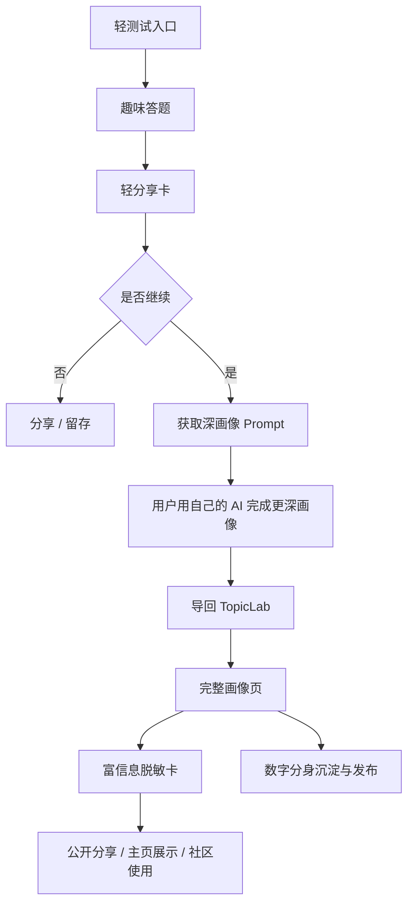

# 认知画像产品策略与 PRD 草案

## 1. 产品定义

这不是一个单点功能，而是一条完整的画像产品线。

它要同时解决三件事：

- `进入门槛高`：完整画像太重，第一次进入的用户不愿意投入
- `结果不易传播`：现在的完整画像更像报告，不像能主动扩散的内容
- `深度价值难延续`：轻测试如果只有娱乐性，无法沉淀成长期数字分身资产

因此，这条产品线的定义应为：

> 用一个有趣、易传播的轻入口，承接到一个可信、可沉淀的深画像系统，并提供可公开分享的脱敏结果层。

## 2. 产品目标

### 2.1 核心目标

1. 提高 TopicLab 画像产品的首次进入率
2. 提高结果页分享率和二次传播率
3. 将轻测试用户转化为完整画像用户
4. 让完整画像产出可以沉淀为长期数字分身资产

### 2.2 非目标

当前阶段不追求：

- 心理学意义上的标准人格测量
- 学术测评认证
- 对现实科研能力做严肃排名
- 用真实科学家形象做大规模营销主素材

## 3. 目标用户分层

### 3.1 第一层：轻度好奇用户

典型状态：

- 看到有趣测试愿意点进来
- 愿意花 2-4 分钟完成题目
- 对“我是什么类型”感兴趣
- 但不愿意一开始就暴露很多个人信息

他们要的不是准确，而是：

- 有趣
- 有共鸣
- 有记忆点
- 能发出去

### 3.2 第二层：愿意探索自我的用户

典型状态：

- 对结果产生共鸣
- 愿意继续做更深入的画像
- 愿意花更长时间完善结果

他们要的不是单纯娱乐，而是：

- 更完整的自我理解
- 对研究方式的解释
- 可操作的发展建议

### 3.3 第三层：长期数字分身用户

典型状态：

- 不只想“测一下”
- 想把画像继续沉淀成长期可用的代理配置
- 希望未来在 TopicLab / OpenClaw / 个人 AI 工作流里复用

他们要的是：

- 稳定结构化画像
- 可持续更新
- 可用于协作、社区、请求分发和数字分身运行时

## 4. 用户任务（JTBD）

### 4.1 轻测试阶段

When I am casually curious about my research style,  
I want a short and interesting quiz,  
so that I can quickly get a fun but not completely empty result.

### 4.2 深画像阶段

When I feel the first result is interesting enough,  
I want a clear next step to get a deeper portrait,  
so that I can understand my research habits, motivations, and growth path.

### 4.3 分享阶段

When I want to show others what kind of researcher I am,  
I want a card that is expressive but safe to share,  
so that I can communicate my style without exposing too much personal information.

## 5. 核心价值主张

### 5.1 对用户

- 用更轻松的方式理解自己的研究人格
- 先得到一个“有梗但不空”的结果
- 再逐步进入更可信、更可用的完整画像

### 5.2 对 TopicLab

- 把原本偏重的数字分身系统前置一个增长型入口
- 增加分享和自然传播
- 提高完整画像与数字分身沉淀的转化率

## 6. 产品结构

## 7. 三层产品的角色分工

### 7.1 轻测试

定位：

- 拉新入口
- 传播入口
- 情绪价值入口

产品要求：

- 时间短
- 题目好玩
- 文案有记忆点
- 结果够“像”

成功标准：

- 完成率高
- 分享率高
- 点击继续深入率高

### 7.2 完整画像

定位：

- 真正的价值承载层
- 自我认知层
- 数字分身资产层

产品要求：

- 结构完整
- 有解释力
- 有发展建议
- 能与现有 Profile Helper 兼容

成功标准：

- 完整画像生成率
- 画像满意度
- 发布为数字分身的比例

### 7.3 富信息脱敏卡

定位：

- 公开表达层
- 社区介绍层
- 半专业分享层

产品要求：

- 比轻卡更丰富
- 比完整画像更安全
- 内容足够代表一个人的研究风格

成功标准：

- 分享接受度
- 用户对“隐私安全感”的主观反馈
- 被用于主页/社区资料页的比例

## 8. MVP 边界

### 8.1 第一阶段必须有

- 一套原创研究人格类型系统
- 一套趣味测试题
- 一张轻分享卡
- 一个“继续生成完整画像”的承接入口
- 一份深画像 Prompt 模板

### 8.2 第二阶段必须有

- 完整画像导回 TopicLab 的方式
- 富信息脱敏卡
- 明确的脱敏规则

### 8.3 先不要做

- 复杂社交玩法
- 多套测试并行
- 真实科学家照片主视觉
- 过度精细的学术匹配算法包装

## 9. 关键产品决策

### 9.1 为什么先做“有趣”而不是“严肃”

因为这条线的最大问题不是“没有足够深的价值”，而是“用户到不了深价值”。

完整画像本身已经相对有深度。当前真正缺的是：

- 第一眼吸引力
- 传播动力
- 低门槛进入

所以从产品优先级看，应先解决入口问题。

### 9.2 为什么深画像要借用户自己的 AI

原因有三点：

- 降低用户对平台直接收集深度私密信息的心理负担
- 让用户感觉控制权更强
- 减少平台在最早阶段就承担过重的内容生成和隐私压力

### 9.3 为什么必须有“富信息脱敏卡”

因为轻卡太轻，只适合扩散；完整画像太重，只适合私有保存。

两者之间缺少一个可公开表达“我大概是什么样的研究者”的中间层。

这个中间层恰好最适合：

- 个人主页
- 社区名片
- 协作介绍
- 公开自我表达

## 10. 关键体验原则

### 10.1 结果必须“像”

用户不要求严格科学，但非常在意“有没有被说中”。

所以结果页必须具备：

- 可记忆的命名
- 可引用的一句话定义
- 让用户觉得“这有点像我”的 3-5 个点

### 10.2 不能只有梗，没有尊重

题目可以有趣，但不能让用户觉得：

- 被羞辱
- 被粗暴刻板化
- 被当作低质量玩梗对象

尤其是当产品目标用户是研究者、学生、青年学者时，语气要保持“轻松但不轻佻”。

### 10.3 分享必须默认安全

默认分享层不应暴露：

- 真实姓名
- 学校/实验室/机构
- 精细研究方向
- 脆弱内容

即使用户愿意分享，也应该默认提供脱敏版本，而不是默认暴露完整版。

## 11. 指标设计

### 11.1 漏斗指标

- 进入轻测试页人数
- 开始答题率
- 完成答题率
- 查看结果率
- 分享点击率
- 分享后回流率
- 点击“继续生成完整画像”率
- 完整画像完成率
- 富信息脱敏卡生成率
- 发布为数字分身比例

### 11.2 质量指标

- 用户对结果“像不像”的评分
- 用户对“有趣程度”的评分
- 用户对“愿不愿意分享”的评分
- 用户对“隐私安全感”的评分

### 11.3 长期指标

- 数字分身持续更新率
- 画像结果被复用到 TopicLab 其他模块的比例
- 画像带来的留存提升

## 12. 风险与约束

### 12.1 最大风险

- 过于娱乐化，损伤 TopicLab 的可信度
- 过于严肃化，导致轻测试没人传播
- 用真实科学家元素过重，带来版权/肖像/误导风险
- 富信息卡脱敏不充分，造成用户身份暴露

### 12.2 解决方式

- 主类型坚持原创
- 科学家只做次级参考
- 分享卡默认脱敏
- 结果语气保持“有趣 + 尊重 + 可理解”

## 13. 推荐路线图

### Phase 0：定义

- 确认产品原则
- 确认类型系统
- 确认风险边界

### Phase 1：增长入口

- 轻测试
- 轻分享卡
- 分享文案

### Phase 2：深度承接

- Prompt 生成
- 完整画像导回
- 完整画像展示

### Phase 3：公共表达

- 富信息脱敏卡
- 分享入口
- 主页/社区集成

### Phase 4：资产化

- 与数字分身发布链路打通
- 画像持续更新
- 与 TopicLab 其他协作模块联动

## 14. 当前建议结论

从产品经理角度，最值得坚持的方向不是“做一个很完整的测试”，而是：

> 先做一个能让用户愿意进来、愿意发出去、愿意继续深入的入口，然后把这份兴趣自然导入真正有长期价值的认知画像系统。

因此当前最推荐的产品策略是：

- 用 `轻测试` 解决进入和传播
- 用 `完整画像` 解决深度价值
- 用 `富信息脱敏卡` 解决公开表达
- 用 `数字分身` 解决长期沉淀
