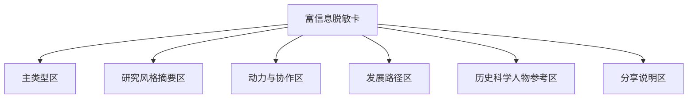
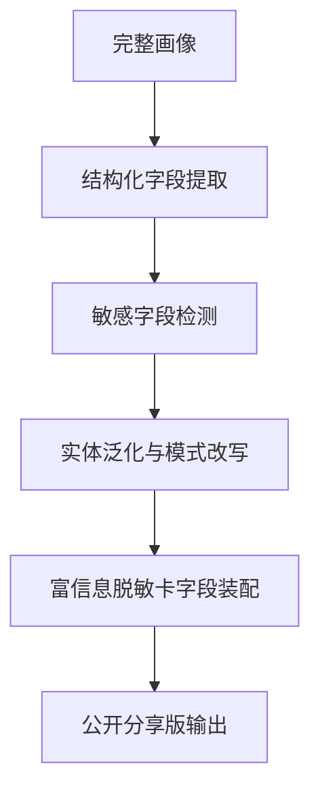

# 富信息脱敏卡字段规范与脱敏规则

## 1. 文档目标

本文定义“富信息脱敏卡”是什么、展示什么、绝不展示什么，以及它如何从完整画像中生成。

它的定位是：

- 比轻分享卡更丰富
- 比完整画像更安全
- 可以成为用户公开表达“我是什么样的研究者”的主要卡片

## 2. 产品定位

### 2.1 它解决的问题

当前只有两种极端：

- `轻卡`：好分享，但内容太浅
- `完整画像`：内容充足，但太私密、不适合公开

富信息脱敏卡就是中间层。

它服务的核心场景：

- 个人主页
- 社区名片
- 协作简介
- 分享“我是什么样的研究者”

### 2.2 它不是

它不是：

- 完整画像的缩略图
- 公开版简历
- 研究成果列表
- 真实身份介绍卡

## 3. 输出原则

### 3.1 代表性

它必须能代表这个人的研究风格，而不是只剩抽象空话。

### 3.2 安全性

它必须默认适合公开分享，不依赖用户自己判断哪些内容太敏感。

### 3.3 可读性

它应该像“一个结构化名片卡”，不是一整篇报告。

## 4. 建议信息结构

建议富信息脱敏卡由 6 个区块组成。

## 5. 字段层级定义

### 5.1 一级字段：必须有

这些字段是 MVP 必须存在的。

| 字段 | 说明 | 来源 |
|---|---|---|
| `type_name` | 原创研究人格类型名 | 轻测试或完整画像映射 |
| `type_subtitle` | 一句话副标题 | 结果模板 |
| `field_cluster` | 高层级领域标签，如“计算 / 实验 / 理论 / 交叉” | identity 泛化结果 |
| `cognitive_style_summary` | 认知风格一句话摘要 | `cognitive_style` |
| `motivation_summary` | 动机来源一句话摘要 | `motivation` |
| `collaboration_summary` | 协作边界与合作方式摘要 | `needs` + 综合解读 |
| `growth_path_summary` | 适合的发展路径一句话摘要 | `interpretation.path` |

### 5.2 二级字段：建议有

这些字段有利于让卡更“像一个人”。

| 字段 | 说明 | 来源 |
|---|---|---|
| `method_style` | 方法偏好泛化摘要 | `identity.method` 泛化 |
| `execution_style` | 执行方式摘要 | `capability.process` + 综合解读 |
| `risk_hint` | 风险提醒一句话 | `interpretation.risks` 提炼 |
| `scientist_refs` | 历史科学人物参考列表 | 映射系统 |

### 5.3 三级字段：谨慎使用

这些字段只有在脱敏充分时才可进入分享层。

| 字段 | 风险 | 建议 |
|---|---|---|
| `research_stage` | 与其他字段组合后可能可识别 | 仅高层保留，如“学生 / 青年研究者 / 独立研究者” |
| `secondary_field` | 容易变得过细 | 必须泛化 |
| `personality_traits` | 可能引发过度人格化标签 | 只保留 1-2 个温和标签 |

## 6. 绝不进入分享层的字段

以下字段应视为默认禁止出现在富信息脱敏卡中：

- 真实姓名
- 学校、实验室、机构、公司名称
- 导师、合作者、团队名称
- 精确研究方向
- 未发表工作
- 当前项目名称
- 具体痛点原文
- 情绪困扰、关系冲突、健康或家庭内容
- 原始论坛画像全文
- 可直接定位身份的组合信息

## 7. 脱敏规则

### 7.1 规则 1：从“具体实体”改成“类别标签”

例如：

- 不写：`清华大学某实验室`
- 改写为：`理工科研究环境`

- 不写：`单细胞转录组与神经炎症`
- 改写为：`生命科学中的数据密集型研究`

### 7.2 规则 2：从“原始细节”改成“模式描述”

例如：

- 不写：`总因为导师回复太慢而焦虑`
- 改写为：`在高不确定反馈环境中更需要稳定节奏感`

### 7.3 规则 3：从“身份点”改成“工作风格”

例如：

- 不写：`博士三年级`
- 改写为：`处于高强度成长阶段的研究者`

### 7.4 规则 4：避免可拼接识别

单个字段看似无害，但组合后可能暴露身份。

例如以下组合要避免同时出现：

- 小领域 + 机构类型 + 研究阶段 + 方法标签

## 8. 展示层级建议

### 8.1 公开分享版

最安全，默认给用户的分享按钮应输出这一版。

包含：

- 类型名
- 副标题
- 高层级领域
- 认知/动机/协作摘要
- 路径建议
- 历史科学人物参考

### 8.2 半公开展示版

适合用户主动用于个人主页或社区介绍。

可以比公开分享版多：

- 研究阶段的大类
- 方法风格
- 1 条风险提醒

前提：

- 仍然通过组合识别检查

### 8.3 私有完整版

这不是富信息脱敏卡的一部分，而是完整画像本体。

## 9. 文案风格要求

### 9.1 推荐风格

- 准确但不僵硬
- 有温度但不煽情
- 专业但不端着
- 让用户愿意转发

### 9.2 不推荐风格

- 过度诊断化
- 太像 HR 评语
- 太像星座文案
- 太像论文摘要

## 10. 与现有完整画像结构的映射

建议映射如下：

| 富信息脱敏卡字段 | 完整画像来源 |
|---|---|
| `type_name` | 轻测试结果或完整画像映射结果 |
| `field_cluster` | `identity.primary_field / secondary_field / cross_field` 泛化 |
| `cognitive_style_summary` | `cognitive_style` |
| `motivation_summary` | `motivation` |
| `collaboration_summary` | `needs` + `personality` + `interpretation` |
| `execution_style` | `capability.process` |
| `growth_path_summary` | `interpretation.path` |
| `risk_hint` | `interpretation.risks` 提炼 |

## 11. 生成流程建议

## 12. 检查清单

在生成富信息脱敏卡时，建议强制检查：

### 12.1 身份检查

- 是否出现真实姓名
- 是否出现机构名称
- 是否出现具体团队或导师

### 12.2 研究内容检查

- 是否出现过细研究方向
- 是否出现未公开项目
- 是否出现可定位的论文或成果线索

### 12.3 脆弱信息检查

- 是否包含明显情绪困扰
- 是否包含关系冲突原文
- 是否包含会让用户后悔公开的私密材料

## 13. MVP 卡面建议

MVP 的富信息脱敏卡建议只包含：

1. 类型名
2. 一句话副标题
3. 3 条摘要：
   - 思维方式
   - 动机方式
   - 协作方式
4. 1 条发展路径建议
5. 1 组历史科学人物参考

这样信息量足够，又不会变成半篇报告。

## 14. 当前建议结论

富信息脱敏卡的核心，不是“把完整画像删短一点”，而是：

> 用一个经过结构化筛选与脱敏重写的中间层，让用户可以更丰富地表达自己，同时不把完整私密画像直接暴露到公开环境中。
