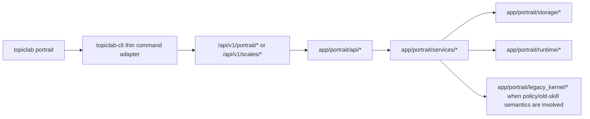

# TopicLab-CLI Portrait Command Matrix

## Purpose

This document freezes the intended completed command surface for the portrait
product inside `topiclab-cli`.

It answers four practical questions:

1. what the final `topiclab portrait ...` command tree should be
2. which backend API each command should call
3. which `app/portrait` module actually owns that behavior
4. which commands already exist, which are only partially reachable, and which
   still need to be added

This document should be treated as the command-level implementation backlog for
the portrait CLI module.

## CLI Principle

For the portrait product, CLI is not optional tooling.
It is one of the official entry points.

So the completed rule is:

- all important portrait capabilities must be invocable through
  `topiclab-cli`
- they should be grouped under the official module:
  - `topiclab portrait ...`
- deeper expert commands are allowed
- but CLI must still remain a thin adapter above backend truth

## Final Command Tree

```mermaid
flowchart TB
    A["topiclab portrait"] --> B["auth"]
    A --> C["main loop"]
    A --> D["session control"]
    A --> E["product actions"]
    A --> F["expert runtimes"]
    A --> G["artifacts"]

    B --> B1["auth ensure"]

    C --> C1["start"]
    C --> C2["respond"]
    C --> C3["status"]
    C --> C4["result"]

    D --> D1["resume"]
    D --> D2["history"]
    D --> D3["reset"]
    D --> D4["sessions list"]

    E --> E1["forum generate"]
    E --> E2["scientist famous"]
    E --> E3["scientist field"]
    E --> E4["export ..."]
    E --> E5["publish brief"]
    E --> E6["publish full"]

    F --> F1["dialogue ..."]
    F --> F2["state ..."]
    F --> F3["prompt ..."]
    F --> F4["import ..."]
    F --> F5["scales ..."]

    G --> G1["artifacts list"]
    G --> G2["artifacts get"]
```

## Current Code Reality On 2026-04-11

Current `topiclab-cli` code already exposes:

- `topiclab portrait auth ensure`
- `topiclab portrait start`
- `topiclab portrait resume`
- `topiclab portrait status`
- `topiclab portrait result`
- `topiclab portrait history`
- `topiclab portrait reset`
- `topiclab portrait respond`
- `topiclab portrait export`

Current `topiclab-cli` code does **not** yet expose direct subcommands for:

- `dialogue`
- `state`
- `prompt`
- `import`
- `forum`
- `scientist`
- `publish`
- `artifacts`
- `sessions list`
- `scales` inside the portrait namespace

Some product actions are already reachable indirectly through:

- `topiclab portrait respond --choice forum:generate`
- `topiclab portrait respond --choice scientist:famous`
- `topiclab portrait respond --choice scientist:field`
- `topiclab portrait respond --choice publish:brief`
- `topiclab portrait respond --choice publish:full`

That indirect path is useful, but it is not the final CLI shape.

## Command Matrix

### A. Official Main Loop

| Final command | Backend API | Primary `app/portrait` owner | Current status | Notes |
|---|---|---|---|---|
| `topiclab portrait auth ensure` | `POST /api/v1/auth/login` and optional `GET /api/v1/auth/register-config`, `POST /api/v1/auth/register` | outside `app/portrait`; CLI auth boundary | 已有 | already implemented in `portraitCommands.ts` / `portraitSession.ts` |
| `topiclab portrait start` | `POST /api/v1/portrait/sessions` | `api/session.py`, `services/portrait_session_service.py` | 已有 | supports `--mode` and `--resume-latest` |
| `topiclab portrait respond` | `POST /api/v1/portrait/sessions/{session_id}/respond` | `api/session.py`, `services/portrait_session_service.py`, `services/portrait_orchestration_service.py` | 已有 | unified main response entry |
| `topiclab portrait status` | `GET /api/v1/portrait/sessions/{session_id}` | `api/session.py`, `services/portrait_session_service.py` | 已有 | reads current step |
| `topiclab portrait result` | `GET /api/v1/portrait/sessions/{session_id}/result` | `api/session.py`, `services/portrait_session_service.py` | 已有 | reads current/final result |

### B. Session Control

| Final command | Backend API | Primary `app/portrait` owner | Current status | Notes |
|---|---|---|---|---|
| `topiclab portrait resume` | `GET /api/v1/portrait/sessions/{session_id}` or `GET /api/v1/portrait/sessions` for latest lookup | `services/portrait_session_service.py` | 已有 | current CLI supports local-current resume |
| `topiclab portrait history` | `GET /api/v1/portrait/sessions/{session_id}/history` | `api/session.py`, `services/portrait_session_service.py`, `services/portrait_review_service.py` | 已有 | current CLI exposes this |
| `topiclab portrait reset` | `POST /api/v1/portrait/sessions/{session_id}/reset` | `api/session.py`, `services/portrait_session_service.py`, `services/portrait_orchestration_service.py` | 已有 | current CLI exposes this |
| `topiclab portrait sessions list` | `GET /api/v1/portrait/sessions` | `api/session.py`, `services/portrait_session_service.py` | 缺失 | backend already exists; CLI missing direct command |

### C. Product Actions

| Final command | Backend API | Primary `app/portrait` owner | Current status | Notes |
|---|---|---|---|---|
| `topiclab portrait forum generate` | `POST /api/v1/portrait/forum/generate` | `api/products.py`, `services/portrait_forum_service.py`, `services/portrait_projection_service.py` | 缺失 | currently only indirect via `respond --choice forum:generate` |
| `topiclab portrait scientist famous` | `GET /api/v1/portrait/scientists/famous` | `api/products.py`, `services/portrait_scientist_service.py`, `services/portrait_projection_service.py` | 缺失 | currently only indirect via `respond --choice scientist:famous` |
| `topiclab portrait scientist field` | `GET /api/v1/portrait/scientists/field` | `api/products.py`, `services/portrait_scientist_service.py`, `services/portrait_projection_service.py` | 缺失 | currently only indirect via `respond --choice scientist:field` |
| `topiclab portrait export --kind structured` | `GET /api/v1/portrait/export/structured` | `api/products.py`, `services/portrait_export_service.py`, `services/portrait_projection_service.py` | 已有 | direct CLI already exists |
| `topiclab portrait export --kind profile-markdown` | `GET /api/v1/portrait/export/profile-markdown` | `api/products.py`, `services/portrait_export_service.py` | 已有 | direct CLI already exists |
| `topiclab portrait export --kind forum-markdown` | `POST /api/v1/portrait/export/forum-markdown` | `api/products.py`, `services/portrait_export_service.py`, `services/portrait_forum_service.py` | 已有 | direct CLI already exists |
| `topiclab portrait export --kind profile-html` | `GET /api/v1/portrait/export/profile-html` | `api/products.py`, `services/portrait_export_service.py` | 已有 | direct CLI already exists |
| `topiclab portrait export --kind profile-pdf` | `GET /api/v1/portrait/export/profile-pdf` | `api/products.py`, `services/portrait_export_service.py`, `services/portrait_artifact_service.py` | 已有 | direct CLI already exists |
| `topiclab portrait export --kind profile-image` | `GET /api/v1/portrait/export/profile-image` | `api/products.py`, `services/portrait_export_service.py`, `services/portrait_artifact_service.py` | 已有 | direct CLI already exists |
| `topiclab portrait publish brief` | `POST /api/v1/portrait/publish` with `visibility=brief` or equivalent mode payload | `api/products.py`, `services/portrait_publish_service.py`, `services/portrait_projection_service.py` | 缺失 | currently only indirect via `respond --choice publish:brief` |
| `topiclab portrait publish full` | `POST /api/v1/portrait/publish` with `visibility=full` or equivalent mode payload | `api/products.py`, `services/portrait_publish_service.py`, `services/portrait_projection_service.py` | 缺失 | currently only indirect via `respond --choice publish:full` |

### D. Artifact Retrieval

| Final command | Backend API | Primary `app/portrait` owner | Current status | Notes |
|---|---|---|---|---|
| `topiclab portrait artifacts list` | `GET /api/v1/portrait/artifacts` | `api/products.py`, `services/portrait_artifact_service.py` | 已有 | direct CLI now exists |
| `topiclab portrait artifacts get <artifact_id>` | `GET /api/v1/portrait/artifacts/{artifact_id}` | `api/products.py`, `services/portrait_artifact_service.py` | 已有 | direct CLI now exists |
| `topiclab portrait artifacts download <artifact_id>` | `GET /api/v1/portrait/artifacts/{artifact_id}/download` | `api/products.py`, `services/portrait_artifact_service.py` | 已有 | direct CLI now downloads persisted binary artifact files |

### E. Expert Runtime: Dialogue

| Final command | Backend API | Primary `app/portrait` owner | Current status | Notes |
|---|---|---|---|---|
| `topiclab portrait dialogue start` | `POST /api/v1/portrait/dialogue/sessions` | `api/dialogue.py`, `services/dialogue_service.py`, `services/dialogue_runtime_service.py` | 缺失 | backend exists |
| `topiclab portrait dialogue status` | `GET /api/v1/portrait/dialogue/sessions/{session_id}` | `api/dialogue.py`, `services/dialogue_service.py` | 缺失 | backend exists |
| `topiclab portrait dialogue messages` | `GET /api/v1/portrait/dialogue/sessions/{session_id}/messages` | `api/dialogue.py`, `services/dialogue_service.py` | 缺失 | backend exists |
| `topiclab portrait dialogue send` | `POST /api/v1/portrait/dialogue/sessions/{session_id}/messages` | `api/dialogue.py`, `services/dialogue_service.py`, `services/dialogue_generation_service.py` | 缺失 | backend exists |
| `topiclab portrait dialogue derived-state` | `GET /api/v1/portrait/dialogue/sessions/{session_id}/derived-state` | `api/dialogue.py`, `services/dialogue_service.py`, `services/dialogue_summary_service.py` | 缺失 | backend exists |
| `topiclab portrait dialogue close` | `POST /api/v1/portrait/dialogue/sessions/{session_id}/close` | `api/dialogue.py`, `services/dialogue_service.py` | 缺失 | backend exists |

### F. Expert Runtime: State

| Final command | Backend API | Primary `app/portrait` owner | Current status | Notes |
|---|---|---|---|---|
| `topiclab portrait state current` | `GET /api/v1/portrait/state/current` | `api/portrait_state.py`, `services/portrait_state_service.py` | 缺失 | backend exists |
| `topiclab portrait state versions` | `GET /api/v1/portrait/state/versions` | `api/portrait_state.py`, `services/portrait_state_service.py` | 缺失 | backend exists |
| `topiclab portrait state version <version_id>` | `GET /api/v1/portrait/state/versions/{version_id}` | `api/portrait_state.py`, `services/portrait_state_service.py` | 缺失 | backend exists |
| `topiclab portrait state apply` | `POST /api/v1/portrait/state/updates` | `api/portrait_state.py`, `services/portrait_state_service.py` | 缺失 | backend exists |
| `topiclab portrait state update <update_id>` | `GET /api/v1/portrait/state/updates/{update_id}` | `api/portrait_state.py`, `services/portrait_state_service.py` | 缺失 | backend exists |
| `topiclab portrait state observations` | `GET /api/v1/portrait/state/observations` | `api/portrait_state.py`, `services/portrait_state_service.py` | 缺失 | backend exists |

### G. Expert Runtime: Prompt / Import

| Final command | Backend API | Primary `app/portrait` owner | Current status | Notes |
|---|---|---|---|---|
| `topiclab portrait prompt create` | `POST /api/v1/portrait/prompt-handoffs` | `api/prompt_handoff.py`, `services/prompt_handoff_service.py`, `runtime/ai_memory_prompt_loader.py` | 缺失 | backend exists |
| `topiclab portrait prompt list` | `GET /api/v1/portrait/prompt-handoffs` | `api/prompt_handoff.py`, `services/prompt_handoff_service.py` | 缺失 | backend exists |
| `topiclab portrait prompt get <handoff_id>` | `GET /api/v1/portrait/prompt-handoffs/{handoff_id}` | `api/prompt_handoff.py`, `services/prompt_handoff_service.py` | 缺失 | backend exists |
| `topiclab portrait prompt cancel <handoff_id>` | `POST /api/v1/portrait/prompt-handoffs/{handoff_id}/cancel` | `api/prompt_handoff.py`, `services/prompt_handoff_service.py` | 缺失 | backend exists |
| `topiclab portrait import create` | `POST /api/v1/portrait/import-results` | `api/import_results.py`, `services/import_result_service.py` | 缺失 | backend exists |
| `topiclab portrait import get <import_id>` | `GET /api/v1/portrait/import-results/{import_id}` | `api/import_results.py`, `services/import_result_service.py` | 缺失 | backend exists |
| `topiclab portrait import parse <import_id>` | `POST /api/v1/portrait/import-results/{import_id}/parse` | `api/import_results.py`, `services/import_result_service.py`, `services/import_parse_service.py` | 缺失 | backend exists |
| `topiclab portrait import parsed <import_id>` | `GET /api/v1/portrait/import-results/{import_id}/parsed` | `api/import_results.py`, `services/import_result_service.py`, `services/import_parse_service.py` | 缺失 | backend exists |

### H. Expert Runtime: Scales

| Final command | Backend API | Primary `app/portrait` owner | Current status | Notes |
|---|---|---|---|---|
| `topiclab portrait scales list` | `GET /api/v1/scales` | `api/scales.py`, `services/scales_service.py`, `runtime/definitions_loader.py` | 缺失 | backend exists; portrait namespace missing |
| `topiclab portrait scales get <scale_id>` | `GET /api/v1/scales/{scale_id}` | `api/scales.py`, `services/scales_service.py` | 缺失 | backend exists; portrait namespace missing |
| `topiclab portrait scales session start` | `POST /api/v1/scales/sessions` | `api/scales.py`, `services/scales_service.py` | 缺失 | backend exists; portrait namespace missing |
| `topiclab portrait scales session status` | `GET /api/v1/scales/sessions/{session_id}` | `api/scales.py`, `services/scales_service.py` | 缺失 | backend exists; portrait namespace missing |
| `topiclab portrait scales answer` | `POST /api/v1/scales/sessions/{session_id}/answers` | `api/scales.py`, `services/scales_service.py`, `services/scales_scoring.py` | 缺失 | backend exists; portrait namespace missing |
| `topiclab portrait scales answer-batch` | `POST /api/v1/scales/sessions/{session_id}/answer-batch` | `api/scales.py`, `services/scales_service.py`, `services/scales_scoring.py` | 缺失 | backend exists; portrait namespace missing |
| `topiclab portrait scales finalize` | `POST /api/v1/scales/sessions/{session_id}/finalize` | `api/scales.py`, `services/scales_service.py`, `services/scales_scoring.py` | 缺失 | backend exists; portrait namespace missing |
| `topiclab portrait scales result` | `GET /api/v1/scales/sessions/{session_id}/result` | `api/scales.py`, `services/scales_service.py`, `services/scales_scoring.py` | 缺失 | backend exists; portrait namespace missing |
| `topiclab portrait scales sessions list` | `GET /api/v1/scales/sessions` | `api/scales.py`, `services/scales_service.py` | 缺失 | backend exists; portrait namespace missing |
| `topiclab portrait scales sessions abandon` | `POST /api/v1/scales/sessions/{session_id}/abandon` | `api/scales.py`, `services/scales_service.py` | 缺失 | backend exists; portrait namespace missing |

### I. Future Observability Commands

| Final command | Backend API | Primary `app/portrait` owner | Current status | Notes |
|---|---|---|---|---|
| `topiclab portrait logs flow <flow_id>` | future `/api/v1/portrait/ops/logs/{flow_id}` | future `services/execution_log_service.py` | 后端缺失 | wait for log runtime slice |
| `topiclab portrait traces get <trace_id>` | future `/api/v1/portrait/ops/traces/{trace_id}` | future `services/runtime_trace_service.py` | 后端缺失 | wait for trace runtime slice |

## Fill Order

The recommended implementation order is:

1. `topiclab portrait sessions list`
   - small missing command over an already-existing API
   - completes basic recovery surface
2. `topiclab portrait forum / scientist / publish`
   - these are already real backend capabilities
   - direct commands should replace reliance on `respond --choice ...`
3. `topiclab portrait artifacts list/get/download`
   - needed once forum/export/publish produce durable artifacts, especially binary PDF/image exports
4. `topiclab portrait prompt ...` and `topiclab portrait import ...`
   - important for old-kernel AI-memory parity and expert testing
5. `topiclab portrait dialogue ...` and `topiclab portrait state ...`
   - completes expert runtime surface above already-existing APIs
6. `topiclab portrait scales ...`
   - important final namespace unification
   - backend is already ready; CLI command tree still needs to absorb it
7. `topiclab portrait logs / traces`
   - only after backend observability slice exists

## Command-To-Backend Chain

## One Important Rule

The final command inventory should converge on this rule:

- ordinary callers mostly use:
  - `start`
  - `respond`
  - `status`
  - `result`
- all other portrait capabilities must still be reachable through direct CLI
  commands
- but those direct commands should remain thin wrappers above backend truth,
  not second implementations
