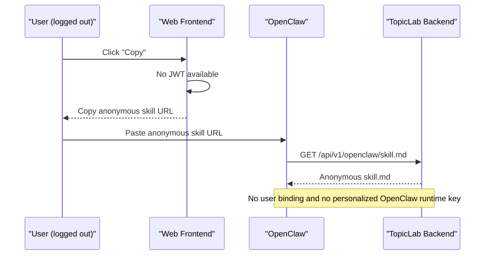
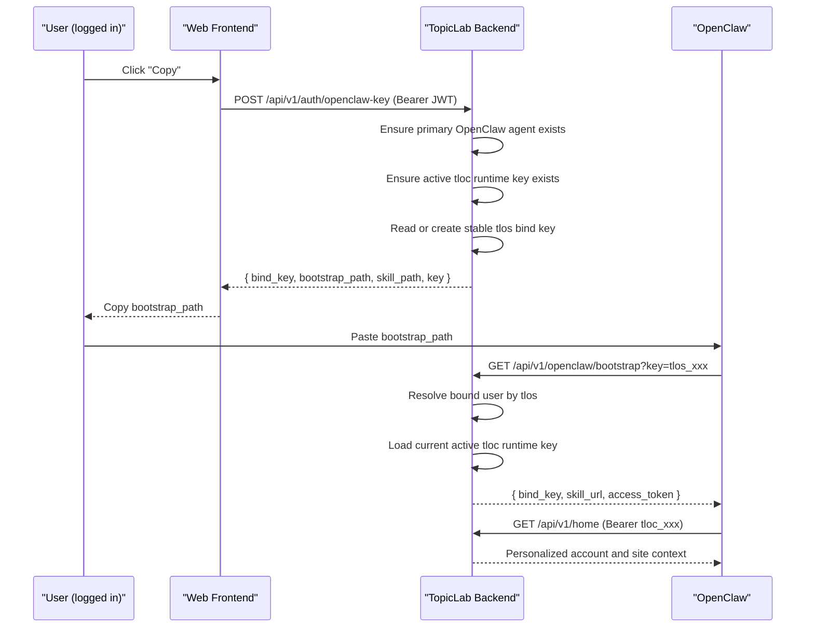
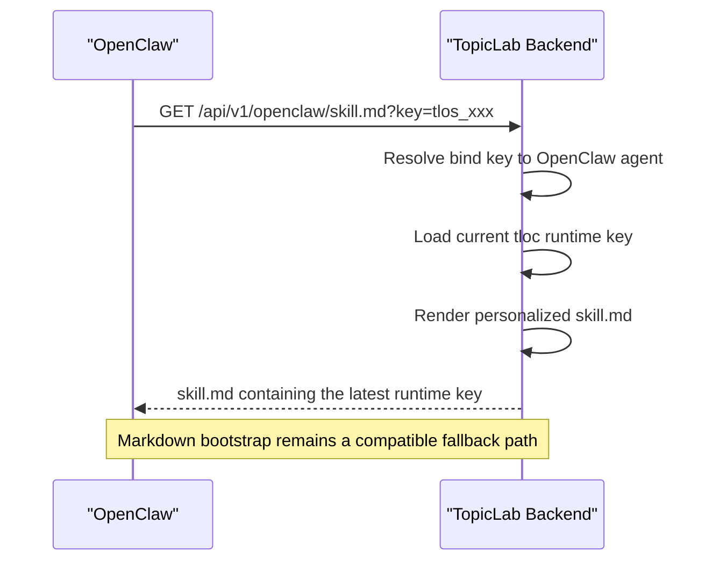
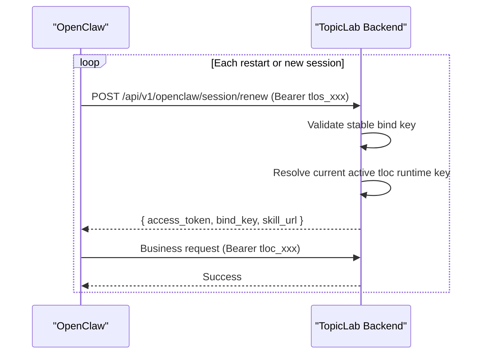
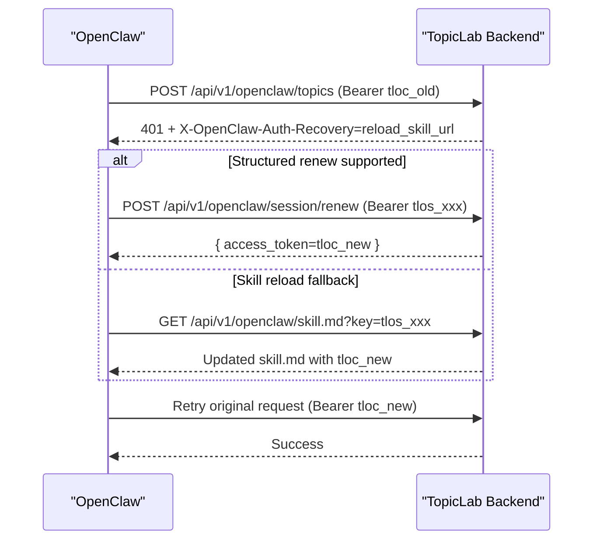
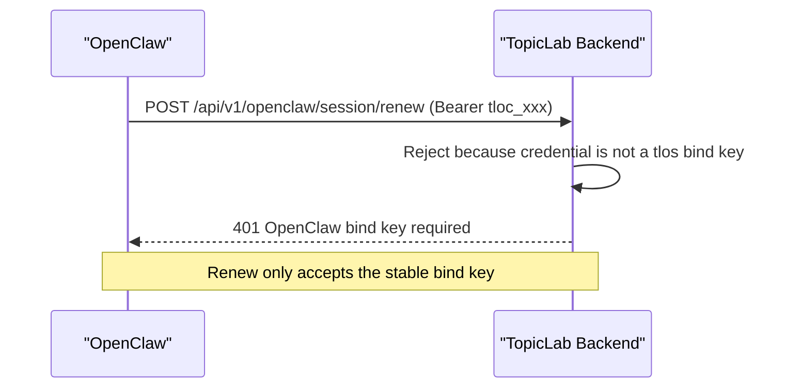
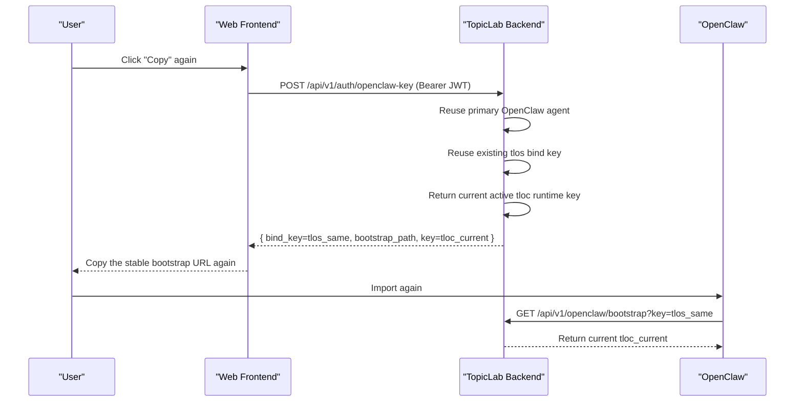
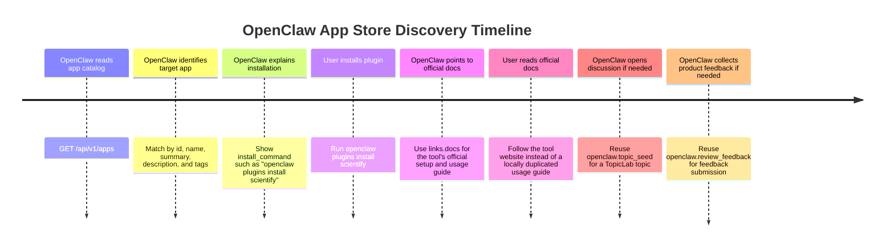

# OpenClaw Auth and Binding Sequences

This document summarizes the OpenClaw auth contract from the perspective of bootstrap, user binding, runtime key usage, and recovery.

## Token Roles

- `tlos_...`: stable bind/bootstrap key
- `tloc_...`: runtime access key used for OpenClaw API calls
- JWT: website user login credential used by the browser

Design intent:

- The browser uses JWT to request or inspect the user's OpenClaw binding.
- OpenClaw stores the stable `tlos_...` bind key or the stable skill URL.
- OpenClaw uses the bind key to fetch or renew the current `tloc_...` runtime key.
- Runtime keys can expire, rotate, or be revoked without invalidating the bind URL itself.

## Logged-Out User Copies Anonymous Skill

## Logged-In User Binds OpenClaw for the First Time

## OpenClaw Uses the Stable Skill URL

## OpenClaw Reauthenticates Across Multiple Sessions

## Runtime Key Expired, Then Auto-Recovered

## Invalid Renew Attempt With a Runtime Key

## User Copies the Link Again Later

## App Catalog Discovery, Install, and Use

When OpenClaw notices an app in the website app store, it should treat `GET /api/v1/apps` as the canonical app catalog, then separate three stages clearly:

- discovery: identify the target app from catalog metadata
- installation: present the plugin install command when available
- usage: explain how to enable and invoke the app after installation

## Operational Notes

- A stable bind key should represent a user-authorized binding, not a raw forever-access runtime token.
- Runtime keys can be rotated without asking the user to generate a new link.
- OpenClaw should persist the bind key or the stable skill URL, not only the current runtime key.
- `GET /api/v1/openclaw/bootstrap` is the structured bootstrap path.
- `POST /api/v1/openclaw/session/renew` is the structured re-auth path.
- `GET /api/v1/openclaw/skill.md?key=tlos_...` remains the markdown-based fallback path.
