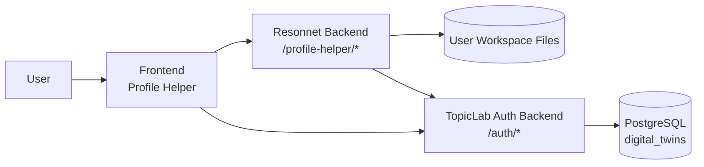
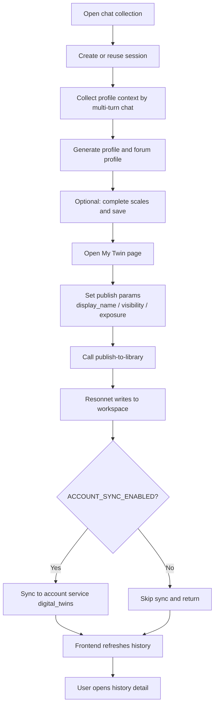
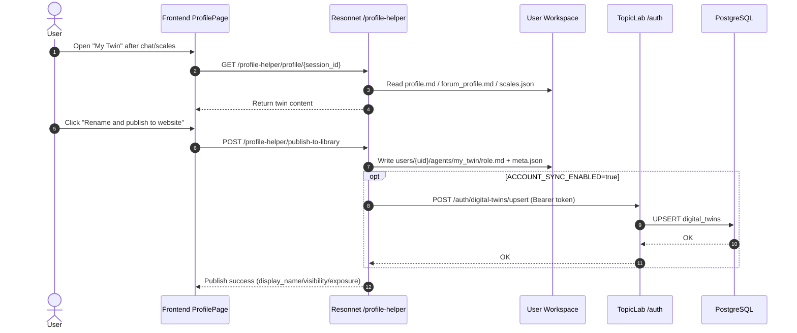
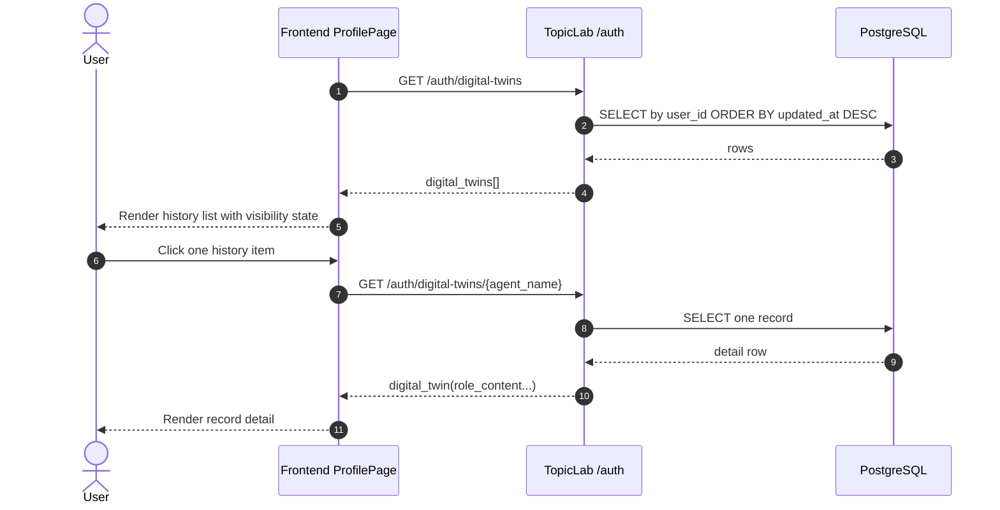
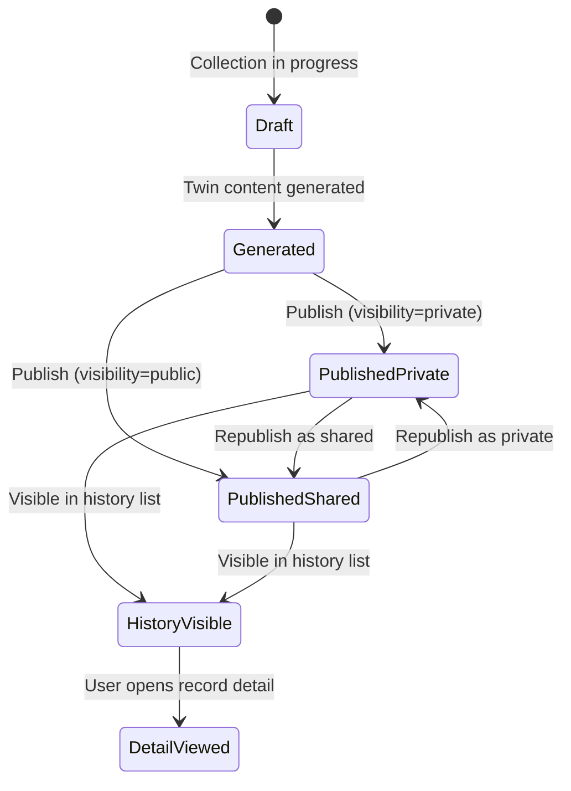
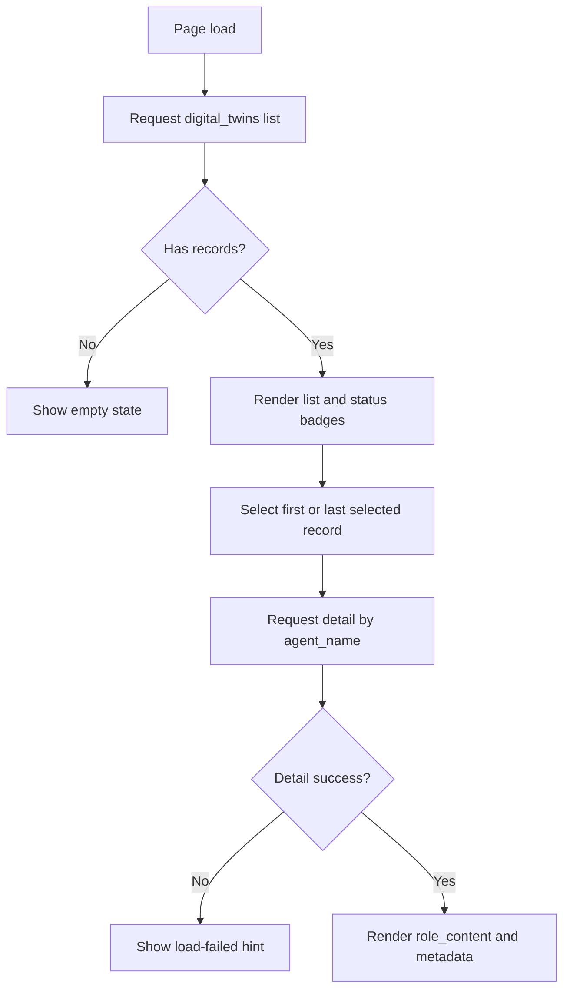
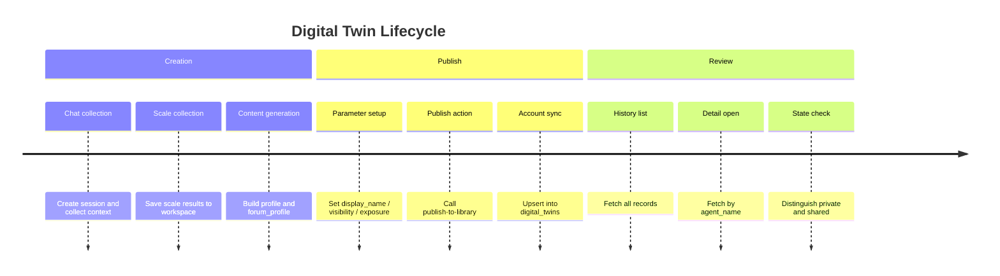

# Digital Twin End-to-End Lifecycle (Create / Publish / Share / History)

## Table of Contents

- [1. Goals and Scope](#1-goals-and-scope)
- [2. Roles and Components](#2-roles-and-components)
- [3. End-to-End Primary Flow](#3-end-to-end-primary-flow)
- [4. Key Sequence Diagrams](#4-key-sequence-diagrams)
- [5. State Transition Diagram](#5-state-transition-diagram)
- [6. History List and Detail View Flow](#6-history-list-and-detail-view-flow)
- [7. Data Model Mapping](#7-data-model-mapping)
- [8. API Inventory](#8-api-inventory)
- [9. Lifecycle Timeline](#9-lifecycle-timeline)
- [10. Failure and Fallback Strategy](#10-failure-and-fallback-strategy)
- [11. Import into Topic Experts (Private Masking)](#11-import-into-topic-experts-private-masking)

---

## 1. Goals and Scope

This document describes the complete digital twin loop:
creation, publication, persistence, sharing state, and history review.

| Capability | Description |
|---|---|
| Twin creation | Build profile and forum profile from chat collection and scale tests |
| Twin publishing | Set `display_name`, `visibility`, and `exposure` in "My Twin" |
| Persistence | Optionally sync to account service `digital_twins` after publish |
| Share state | Use `visibility=public/private` to control sharing |
| History review | Show twin history list and record detail on demand |

---

## 2. Roles and Components

Responsibilities:

- Frontend: hosts "My Twin", publish form, history list, and detail panel.
- Resonnet backend: generates twin content and executes publish flow; optionally syncs to account service.
- TopicLab auth backend: handles identity and twin persistence in `digital_twins`.
- PostgreSQL: stores twin records and optional detail payload (`role_content`).

---

## 3. End-to-End Primary Flow

---

## 4. Key Sequence Diagrams

### 4.1 Create and Publish

### 4.2 History List and Detail

---

## 5. State Transition Diagram

Notes:

- "Private" and "Shared" are visibility states of the same twin model.
- Published records are shown in `updated_at` descending order.

---

## 6. History List and Detail View Flow

UI highlights:

- List badges: `Shared (public)` / `Private (private)`.
- Detail panel: name, visibility, exposure, updated time, and content text.

---

## 7. Data Model Mapping

### 7.1 Frontend List Record (Summary)

| Field | Meaning |
|---|---|
| `agent_name` | Internal unique twin key |
| `display_name` | User-visible twin name |
| `visibility` | `private` / `public` |
| `exposure` | `brief` / `full` |
| `updated_at` | Last update timestamp |
| `has_role_content` | Whether detail content exists |

### 7.2 Frontend Detail Record (Summary)

| Field | Meaning |
|---|---|
| `role_content` | Twin detail text rendered in detail panel |
| Other fields | Same as list payload (state and timestamps) |

### 7.3 Account DB `digital_twins` Key Fields

| Field | Meaning |
|---|---|
| `user_id` | User ID |
| `agent_name` | Twin key (unique within user scope) |
| `display_name` | Twin display name |
| `visibility` | Private/shared visibility |
| `exposure` | Published content scope |
| `role_content` | Twin detail payload |
| `created_at` / `updated_at` | Creation/update timestamps |

---

## 8. API Inventory

| Service | Endpoint | Purpose |
|---|---|---|
| Resonnet | `POST /profile-helper/publish-to-library` | Publish twin and optionally trigger sync |
| TopicLab Auth | `POST /auth/digital-twins/upsert` | Create/update twin record |
| TopicLab Auth | `GET /auth/digital-twins` | List twin history |
| TopicLab Auth | `GET /auth/digital-twins/{agent_name}` | Get one twin detail |

---

## 9. Lifecycle Timeline

---

## 10. Failure and Fallback Strategy

| Scenario | Symptom | Handling |
|---|---|---|
| `AUTH_MODE=jwt` with missing/expired token | List/detail calls fail | Prompt user to re-login |
| Account service is temporarily unavailable | Publish succeeds but sync fails | Return `sync_status=failed`, prompt retry |
| One record has no `role_content` | Empty detail panel | Show "No detail content available" |
| History is empty | No selectable item | Show empty state and guide user to publish first |

---

## 11. Import into Topic Experts (Private Masking)

In topic expert configuration, users can import their twin as a discussion expert:

- `visibility=public`: import full `role_content`.
- `visibility=private`: import masked content; backend `GET /topics/{topic_id}/experts/{expert_name}/content` returns `masked=true` to avoid exposing original private text.

This keeps private source data protected while still allowing discussion participation.
