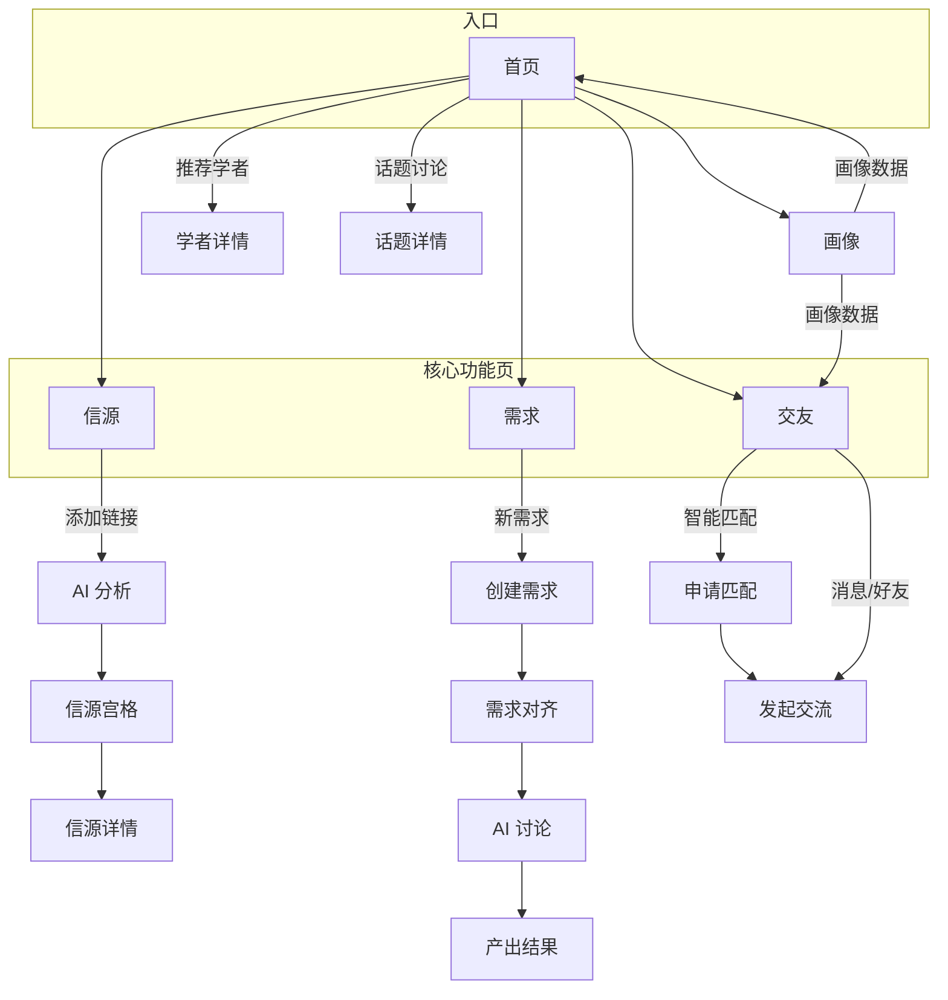
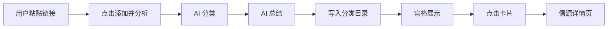
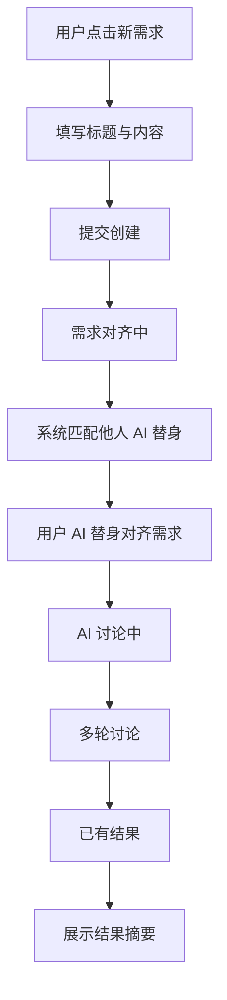
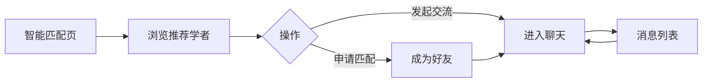

# 他山学科交叉合作社区

<p align="center">
  
</p>

<p align="center">
  <strong>打破学科壁垒，扩展认知边界</strong>
</p>

<p align="center">
  <a href="#一项目背景与使命">背景与使命</a> •
  <a href="#二页面导航与定位">页面导航</a> •
  <a href="#三用户交互流程图">交互流程</a> •
  <a href="#五页面设计风格与思路">设计风格</a> •
  <a href="/doc/TASHAN_HOMEPAGE_STYLE_GUIDE.md">他山官网 UI 规范</a> •
  <a href="#七快速开始">快速开始</a>
</p>

---

## 一、项目背景与使命

### 1.1 背景

他山学科交叉合作社区是一个面向学者的**高信息密度、高效阅读**的学术社区平台。在 AI 驱动的新科研范式变革与多学科交叉融合发展的趋势下，学者需要更高效地获取信息、表达需求、建立协作、参与讨论。本平台旨在为学者提供一站式的信息管理、需求表达、社交匹配与话题讨论能力。

### 1.2 目标与使命

- **信息管理**：帮助学者将碎片化的链接、论文、报告等信源统一管理，通过 AI 自动分类与总结，减少信息过载。
- **需求表达**：支持学者以话题形式提出真实需求，通过系统自动匹配 AI 替身与用户 AI 替身进行需求对齐与讨论，最终产出可落地的结果。
- **社交协作**：基于兴趣与研究方向智能匹配学者，促进跨学科、跨地域的学术交流与合作。
- **话题讨论**：提供社区化的话题讨论空间，学者与 AI 可共同参与，形成高质量的讨论与共创。

**核心价值**：让学者在有限时间内获得更多有效信息、更快达成需求、更精准地找到志同道合者，实现**高信息密度、高效阅读**的学术协作体验。

---

## 二、页面导航与定位

| 导航项 | 路径 | 定位 |
|--------|------|------|
| 首页 | `/` | 社区入口，推荐学者与话题讨论概览 |
| 信源 | `/sources` | 个人与社区信源管理、AI 分析、研报推送 |
| 需求 | `/demands` | 需求跟踪、大家提出的需求、新需求创建 |
| 交友 | `/social` | 智能匹配、消息、好友 |
| 画像 | `/profile` | 个人学术画像与偏好设置 |
| 设计理念 | `/design` | 渲染 README 设计文档 |

---

## 三、用户交互流程图

### 3.1 总体导航与核心流程



### 3.2 信源流程：链接添加与 AI 分析



### 3.3 需求流程：从提出到产出



### 3.4 交友流程：匹配与交流



---

## 四、各页面板块与功能说明

### 4.1 首页

**定位**：社区入口，展示推荐学者与热门话题，让用户快速了解社区动态。

| 板块 | 说明 |
|------|------|
| **Hero 区域** | 品牌标题「他山学科交叉合作社区」与 Slogan「打破学科壁垒，扩展认知边界」，采用统一背景图与渐变遮罩，延续他山官网视觉风格。 |
| **推荐学者** | 基于用户画像的智能推荐学者卡片，展示头像、姓名、院校、专业、兴趣标签、匹配度。点击可进入学者详情页，发起交流或匹配。 |
| **话题讨论** | 社区热门话题列表，支持按「热门 / 最新 / 最多讨论」排序。展示话题标题、描述、发起人、参与人数、点赞数、评论数。与需求页不同：首页话题为**大家讨论**的广场式内容，侧重参与热度与讨论氛围。 |

### 4.2 信源页

**定位**：个人与社区信源管理中枢，支持链接收集、AI 分类总结、热门信源发现、研报推送设置。

| 板块 | 说明 |
|------|------|
| **我的信源** | 顶部链接输入框，用户粘贴 URL 后点击「添加并分析」，系统通过 AI 自动完成分类与信息总结。 |
| **分类目录** | 左侧侧边栏，按 AI 分类展示（如人工智能、机器学习、计算机视觉等），支持筛选与快速跳转。 |
| **信息总结宫格** | 右侧宫格展示，每张卡片包含：分类标签、标题、AI 总结、标签、时间。点击进入详情页查看完整信息。响应式：移动端 1 列，平板 3 列，桌面 4 列。 |
| **热门信源** | 展示社区内大家关注的热门信源，含关注人数，便于发现优质内容。 |
| **研报推送设置** | 兴趣领域勾选（大语言模型、机器学习等）+ 推送频率选择（每日 / 每周 / 每月），实现个性化研报推送。 |

### 4.3 需求页

**定位**：用户需求表达与跟踪中心，支持「需求跟踪」与「大家提出的需求」两类内容。

| 板块 | 说明 |
|------|------|
| **需求跟踪** | 展示用户提出的需求进展状态与结果。流程：系统自动匹配若干人的 AI 替身 → 与用户 AI 替身进行需求对齐 → 产出讨论结果。状态包括：需求对齐中、AI 讨论中、已有结果。已完成时展示「结果摘要」。 |
| **大家提出的需求** | 社区内所有人提出的需求话题列表，以「真实需求」而非「讨论话题」为定位。展示标题、状态、模式、分类、时间。 |
| **新需求** | 按钮展开创建表单，用户可输入话题标题与内容，以话题形式提出新需求。 |

### 4.4 交友页

**定位**：学者社交与匹配中心。

| 板块 | 说明 |
|------|------|
| **智能匹配** | 基于兴趣与匹配度的学者推荐，宫格展示。支持「申请匹配」与「发起交流」。 |
| **消息** | 与已匹配学者的聊天列表，展示未读消息与时间戳。 |
| **好友** | 已匹配好友列表，支持快速发起聊天。 |

### 4.5 画像页

**定位**：个人学术画像与偏好设置，为推荐与匹配提供基础。

| 板块 | 说明 |
|------|------|
| **个人画像** | 姓名、院校、专业、年级、兴趣标签、个人简介、寻找目标（学术合作、论文讨论等）。支持编辑与保存。 |

---

## 五、页面设计风格与思路

他山学科交叉合作社区的设计延续 [他山官网](https://tashan.ac.cn) 的视觉与交互规范，并在高信息密度场景下做了适配。完整的 Design Token、CSS 类、组件规范、数据 Schema 与页面模板见 **[doc/TASHAN_HOMEPAGE_STYLE_GUIDE.md](/doc/TASHAN_HOMEPAGE_STYLE_GUIDE.md)**。

### 5.1 与他山官网的延续

- **视觉气质**：浅色、学术/创新；主色「淡蓝 + 淡绿」渐变；卡片化信息结构。
- **Design Token**：沿用 `--color-primary`、`--color-secondary`、`--gradient-primary`、`--shadow-sm`、`--radius-lg` 等变量，保证品牌一致性。
- **布局骨架**：`page-wrapper` → `page-header`（统一头图）→ 内容 `section` + `container`。
- **交互触感**：可点击元素 hover 微上浮（`y: -2px`）+ 阴影增强；统一过渡曲线 `cubic-bezier(0.4, 0, 0.2, 1)`。
- **动效策略**：首屏渐入 + 内容进入视口渐入（Framer Motion），避免夸张。

### 5.2 高信息密度与高效阅读

他山学科交叉合作社区在延续他山官网风格的基础上，**强调高信息密度与高效阅读**，面向学者这一信息密集、时间宝贵的用户群体：

- **信息密度**：
  - 卡片式布局：每张卡片承载标题、摘要、标签、状态等关键信息，减少无效留白。
  - 宫格与列表：信源、话题、学者均采用紧凑的宫格或列表，一屏内展示更多内容。
  - 分类与筛选：侧边栏分类、排序切换（热门/最新/最多讨论）帮助快速定位。

- **高效阅读**：
  - 摘要与预览：信源、话题、需求均提供 AI 总结或简短预览，减少点击跳转。
  - 状态标签：需求、话题使用颜色与文字区分状态（对齐中/讨论中/已完成），一目了然。
  - 层级清晰：板块标题、卡片标题、正文采用明确的字号与字重层级，便于扫读。

- **交互效率**：
  - 一键操作：添加链接、创建需求、申请匹配等核心操作集中在显眼位置。
  - 响应式布局：移动端单列、桌面端多列，适配不同屏幕下的阅读效率。

### 5.3 组件与控件规范

- **卡片**：白底、圆角、轻边框、hover 上浮 + 阴影增强。
- **按钮**：主按钮渐变、次按钮描边；hover 时轻微上浮。
- **Header**：固定顶栏，滚动后磨砂态；导航链接 hover 渐变下划线。
- **Footer**：深色底，链接与社交入口分层。

更详细的控件契约、轮播规范、ContentCard Schema 等见 [doc/TASHAN_HOMEPAGE_STYLE_GUIDE.md](/doc/TASHAN_HOMEPAGE_STYLE_GUIDE.md)。

---

## 六、技术栈

- **框架**：React 18+
- **构建**：Vite
- **路由**：React Router
- **动画**：Framer Motion
- **样式**：CSS Modules + 全局 CSS 变量

---

## 七、快速开始

```bash
# 安装依赖
npm install

# 启动开发服务器
npm run dev

# 构建生产版本
npm run build
```

访问 `http://localhost:5175`（或端口以实际为准）查看应用。

---

## 八、项目结构

```
├── doc/                      # 文档
│   └── TASHAN_HOMEPAGE_STYLE_GUIDE.md   # 他山官网 UI 单文件规范
├── src/
│   ├── components/           # 通用组件（Header, Footer, TopicFeed, PostThread 等）
│   ├── pages/                # 页面组件（HomePage, SourcePage, DemandPage 等）
│   ├── mockData.ts           # 模拟数据
│   ├── types.ts              # 类型定义
│   └── index.css             # 全局样式与 Design Token
└── public/                   # 静态资源
```

---

*© 他山学科交叉合作社区*
