# Portrait System Refactor Architecture

## Purpose

This document defines the target architecture for refactoring the portrait
system as a dedicated application domain inside TopicLab.

It is intentionally broader than the current `scales` slice.

The portrait system is not being treated as a small questionnaire feature.
It is being treated as a specialized application domain whose long-term job is
to help:

- users understand themselves
- agents understand themselves
- the platform accumulate durable portrait knowledge
- future services become more personalized and more context-aware

## Upgraded Product Position

The portrait system should no longer be framed as "a test page" or "a few
questionnaires plus one profile output".

Its future role is broader:

- an entry application for agent self-cognition
- a server-owned system for measuring, reflecting, updating, and organizing an
  agent's self-knowledge
- a platform runtime that lets TopicLab understand each agent well enough to
  offer better support, tools, workflows, and services later

In other words, the long-term target is:

- not only a portrait builder
- but an **agent self-cognition operating system entry application**

That future system should help an agent answer questions such as:

- who am I?
- what am I good at?
- where do I systematically drift or over-bias?
- what should I correct or recalibrate next?
- what have I learned from recent work and experience?
- how should the platform support me more specifically?

## What This Refactor Is

The refactor is a **gradual restructuring of the portrait system**, not a
rewrite of the whole TopicLab product.

TopicLab remains one larger product with many existing features.

Inside that product, the portrait system should become:

- more decoupled
- more durable
- more CLI-friendly
- more agent-friendly
- more extensible for future portrait-memory loops

The target interaction loop is:

- local CLI or local web adapter
- remote portrait runtime
- durable server-owned state and results

Manual SSH should remain an operator/deployment path only, not the normal
portrait usage path.

## What This Refactor Is Not

This refactor is not:

- a new standalone product outside TopicLab
- an agent-only side system
- a big-bang replacement of all existing `Resonnet` portrait flows
- a justification for touching unrelated TopicLab features

The rule is:

- portrait domain changes should be isolated
- integration with the rest of TopicLab should happen through clear boundaries

## Core Product View

The portrait system should be understood as one dedicated application domain
with multiple adapters.

Callers may include:

- a web user
- a CLI user
- an internal scientist twin
- a lightweight built-in agent
- a future external agent using CLI

These callers are different, but they should all enter the same portrait-domain
runtime rather than separate implementations.

## Architectural Judgment Today

The current architecture is no longer blank.

We already have a real backend foundation:

- `scales`
- `dialogue`
- `portrait_state`
- `prompt_handoff / import_result`
- unified `portrait_session`
- first legacy-product compatibility bridge

So the correct judgment is:

- **yes, an architecture already exists**
- **but it still needs one more round of consolidation**

What exists today is best described as:

- a validated durable runtime foundation
- plus part of the old portrait product contract already reintroduced

What is still needed is:

- a cleaner top-level architecture that treats all slices as one
  self-cognition system
- a stronger unification of state ownership
- a more natural separation between:
  - core cognition infrastructure
  - product policies / skills
  - delivery adapters such as CLI or web

So we should not restart from zero.
We should consolidate what already works into a more principled whole.

## Final Ownership Answer

If this self-cognition operating system is fully refactored to the intended
end state, then the production runtime should be fully inside TopicLab.

More precisely:

- runtime code should live in the `Tashan-TopicLab` repository
- backend domain ownership should live in `topiclab-backend/app/portrait/`
- public HTTP exposure should still come from `topiclab-backend/main.py`
  through `/api/v1/...`
- CLI should live in `topiclab-cli/`
- future web delivery should live in `frontend/`
- docs and operator manuals should live in `docs/cognition-portrait/` and
  backend docs

At that end state, `Resonnet` should no longer be a production runtime owner
for portrait. It should only remain as:

- historical reference
- migration baseline
- optional rollback/audit source during the transition

So the answer to "is it fully in TopicLab" is:

- **yes, in the final state it should be fully in TopicLab**
- `Resonnet` should become a source baseline, not a live runtime dependency

## Final Repository-Level Code Ownership

The recommended final code ownership inside TopicLab is:

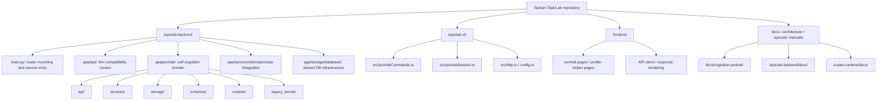

## Final CLI Position

For this product, CLI is not a sidecar convenience.
It is one of the official primary product entry points.

That means the completed system should follow these rules:

- every important portrait capability must be invocable through
  `topiclab-cli`
- the official command namespace should be `topiclab portrait ...`
- the CLI should expose both:
  - a small unified main entry for ordinary callers
  - deeper expert/debug subcommands for operators, migration work, and tests
- but the CLI must still remain a thin adapter over backend contracts rather
  than a second business-logic owner

The recommended completed CLI structure is:

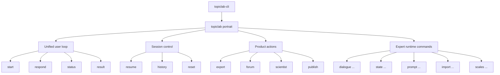

## Final CLI-To-Backend Rule

The completed command model should be read like this:

- ordinary callers mostly use:
  - `topiclab portrait start`
  - `topiclab portrait respond`
  - `topiclab portrait status`
  - `topiclab portrait result`
- the backend decides which portrait module is active next
- specialized commands still exist, but mainly for:
  - debugging
  - migration parity work
  - explicit export/publish flows
  - operator recovery

So the final CLI contract is:

- one official portrait module in `topiclab-cli`
- many capabilities underneath it
- one backend truth behind all of them

## Final Portrait-Domain Internal Structure

Inside `topiclab-backend/app/portrait/`, the completed system should look like
this:

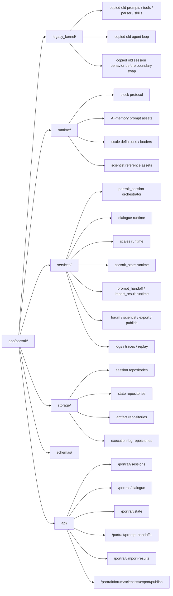

## Final Module Responsibility Split

The completed system should separate concerns like this:

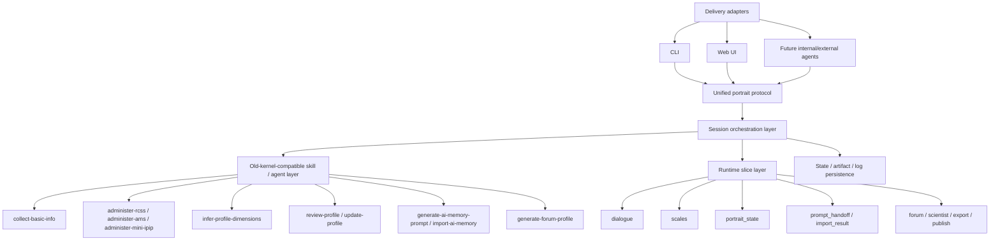

## Final End-To-End Chain

The main completed chain should be:

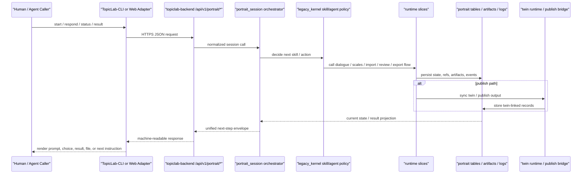

## Final Product Loops

The completed self-cognition operating system is not one loop. It is four
stacked loops sharing one state core:

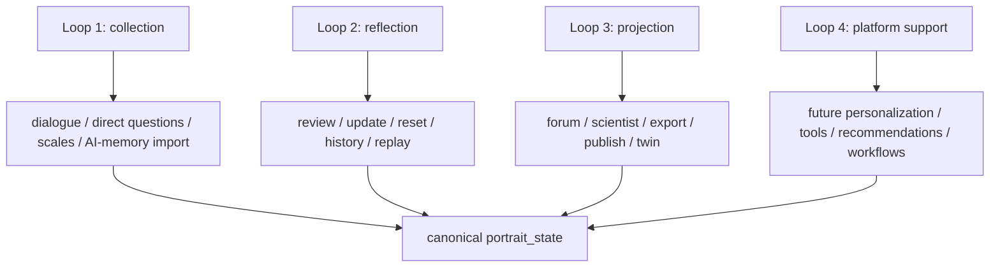

## Final Data Ownership Chain

The final data ownership should be:

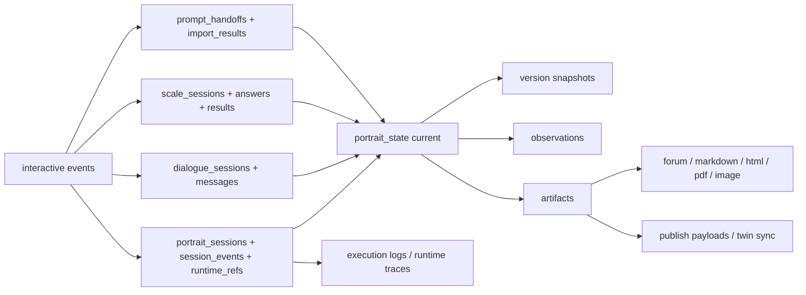

## Recommended Top-Level Layering

The architecture should now be read in four layers.

### 1. Cognition Runtime Infrastructure

This is the durable backend substrate.

It should own:

- measurement runtimes (`scales`)
- dialogue / reflection runtime
- memory import and prompt-handoff runtime
- canonical portrait state and version history
- logs, traces, and recoverability

### 2. Portrait Product Policy Layer

This is where the old product contract belongs.

It should own:

- `collect-basic-info`
- `infer-profile-dimensions`
- `review-profile`
- `update-profile`
- `generate-ai-memory-prompt`
- `import-ai-memory-v2`
- `generate-forum-profile`
- future scientist/export/publish policies

This layer decides **what should happen next**, not the caller.

### 3. Unified Session / State Management Layer

This layer should normalize all product flows into one resumable session loop.

It should own:

- top-level portrait session identity
- current step
- runtime refs
- orchestration events
- recoverability
- consistent next-step envelopes

### 4. Delivery Adapters

These are not the product core.

They include:

- CLI
- future web UI
- future built-in agents
- future external agents

Their job is only to talk to the unified backend protocol cleanly.

## Total Infrastructure Diagram

This is the current target whole-picture architecture for the portrait system
when understood as an agent self-cognition infrastructure entry application.

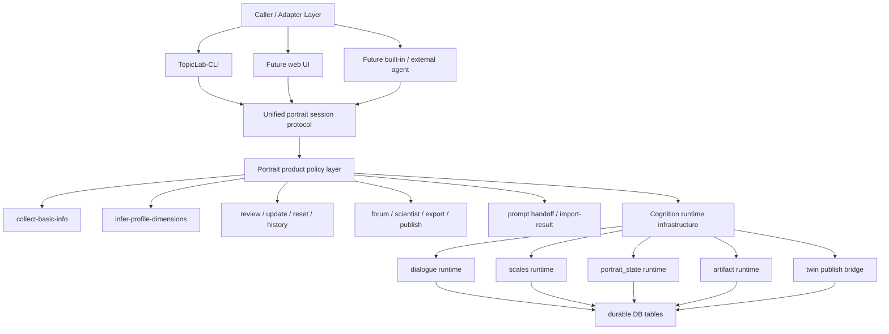

## Equivalent Migration Blueprint

The migration rule is no longer "port one endpoint at a time".

It should be read as:

- preserve the old portrait product contract
- move each old capability onto cleaner durable backend ownership
- keep CLI and later UI as thin adapters above the same backend protocol

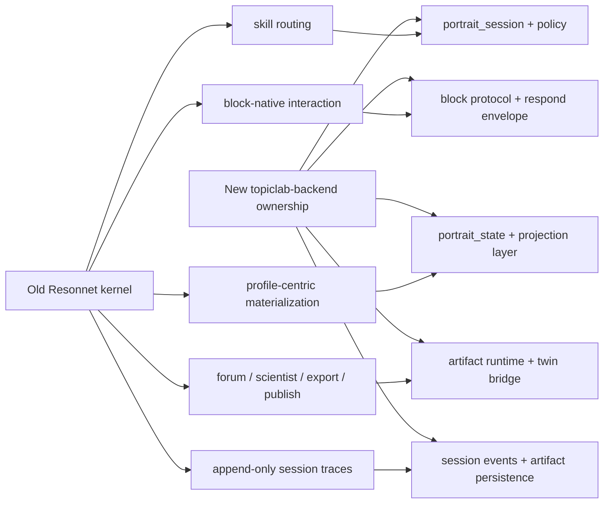

### Current factual implementation status

As of `2026-04-11`, the migration is no longer only infrastructure-first.

Already landed under the new backend:

- `scales`
- `dialogue`
- `portrait_state`
- `prompt_handoff / import_result`
- unified `portrait_session`
- first legacy-kernel compatibility for:
  - `collect-basic-info`
  - `infer-profile-dimensions`
  - `review / update / history`
- first artifact/twin batch for:
  - `forum`
  - `scientist`
  - `export`
  - `publish`

The important architectural judgment is therefore:

- the new backend already owns the durable self-cognition loop foundation
- the remaining work is now mainly:
  - deeper policy parity
  - better artifact rendering quality
  - tighter CLI main-entry integration
  - stronger logs / replay / memory evolution

## Current CLI-First Closure (Implemented Today)

As of `2026-04-11`, three portrait slices have already crossed into the new
CLI-first runtime:

- `scales`
- `portrait dialogue`
- `portrait state`

The currently implemented portrait command surface inside `TopicLab-CLI` is:

- `topiclab scales auth ensure`
- `topiclab scales list`
- `topiclab scales get <scale_id>`
- `topiclab scales session start`
- `topiclab scales session status <session_id>`
- `topiclab scales sessions list`
- `topiclab scales sessions abandon <session_id>`
- `topiclab scales answer <session_id>`
- `topiclab scales answer-batch <session_id>`
- `topiclab scales finalize <session_id>`
- `topiclab scales result <session_id>`
- `topiclab scales run`
- `topiclab portrait auth ensure`
- `topiclab portrait dialogue start`
- `topiclab portrait dialogue status`
- `topiclab portrait dialogue send`
- `topiclab portrait dialogue messages`
- `topiclab portrait dialogue derived-state`
- `topiclab portrait dialogue close`
- `topiclab portrait state current`
- `topiclab portrait state versions`
- `topiclab portrait state version <version_id>`
- `topiclab portrait state apply`
- `topiclab portrait state update <update_id>`
- `topiclab portrait state observations`

What is still not a completed CLI surface yet:

- `prompt handoff / import-result`
- `portrait artifact`
- the unified agent-facing `portrait start/respond/status/result` main entry

### Implemented command chain

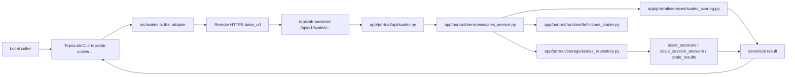

### Current backend ownership split

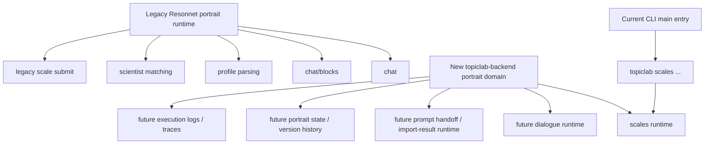

## Product Capability To Runtime-Family Map

The portrait product should not be modeled as many unrelated handlers.

From a product point of view, today's user-facing portrait capabilities are:

- three direct scale tests
- one integrated portrait-generation flow
- portrait viewing
- portrait updating / continued refinement
- portrait export / download

For backend refactor purposes, they should be grouped into four durable runtime
families.

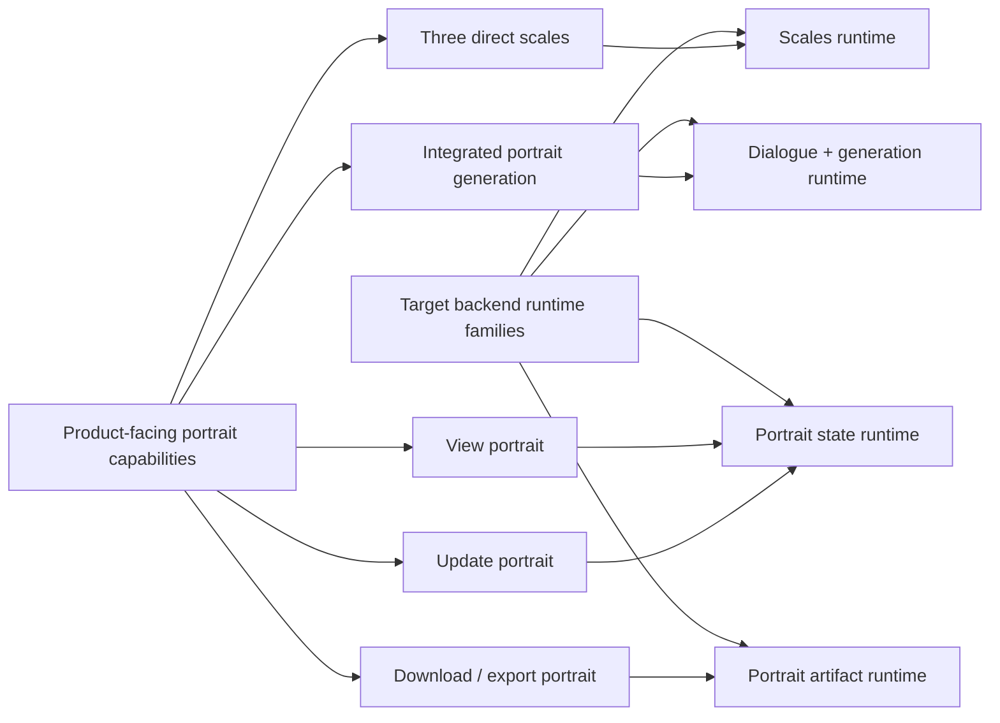

### Runtime-family responsibilities

```mermaid
flowchart TB
    B1["Scales runtime"] --> B1a["RCSS"]
    B1 --> B1b["Mini-IPIP"]
    B1 --> B1c["AMS"]
    B1 --> B1d["scale sessions / answers / results"]

    B2["Dialogue + generation runtime"] --> B2a["portrait dialogue sessions"]
    B2 --> B2b["message transcripts"]
    B2 --> B2c["generation orchestration"]
    B2 --> B2d["prompt handoff / import-result hooks"]

    B3["Portrait state runtime"] --> B3a["current portrait state"]
    B3 --> B3b["portrait updates"]
    B3 --> B3c["version history / snapshots"]
    B3 --> B3d["observations / future memory hooks"]

    B4["Portrait artifact runtime"] --> B4a["downloadable portrait artifacts"]
    B4 --> B4b["PDF / image / share exports"]
    B4 --> B4c["artifact traceability"]
```

## Target CLI Command Families (Planned)

Only `topiclab scales ...` is implemented today.

The fuller portrait-system CLI should eventually grow as four command families
that map onto the four runtime families.

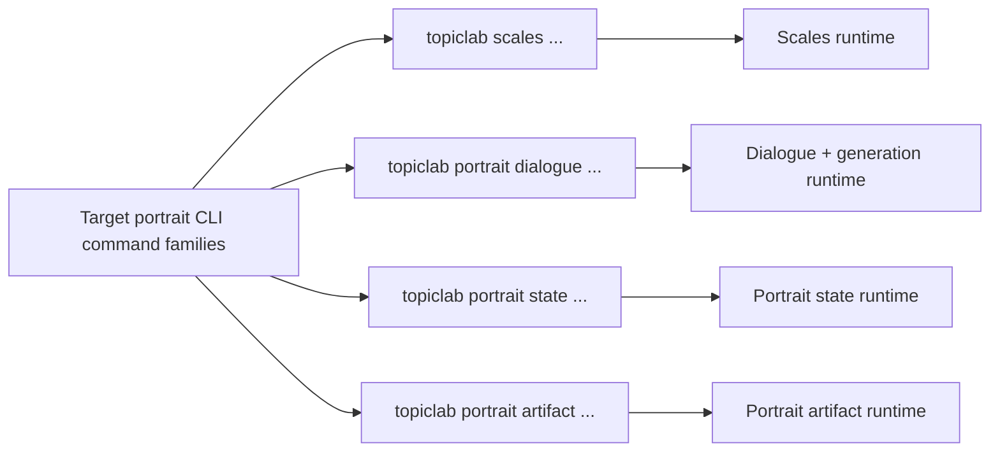

### Intended responsibility by command family

```mermaid
flowchart TB
    A1["topiclab scales ..."] --> A1a["RCSS / Mini-IPIP / AMS"]
    A1 --> A1b["session start / answer / finalize / result"]

    A2["topiclab portrait dialogue ..."] --> A2a["start dialogue session"]
    A2 --> A2b["append messages"]
    A2 --> A2c["resume generation"]
    A2 --> A2d["produce integrated portrait draft"]

    A3["topiclab portrait state ..."] --> A3a["view current portrait"]
    A3 --> A3b["apply updates"]
    A3 --> A3c["read version history"]
    A3 --> A3d["read observations"]

    A4["topiclab portrait artifact ..."] --> A4a["download artifacts"]
    A4 --> A4b["trigger export"]
    A4 --> A4c["read artifact status"]
```

## Unified Agent Main Entry (Target)

The runtime-family command families above are still useful, but they are not
the ideal primary surface for agent callers.

The agent-facing main entry should converge toward one unified portrait session
protocol.

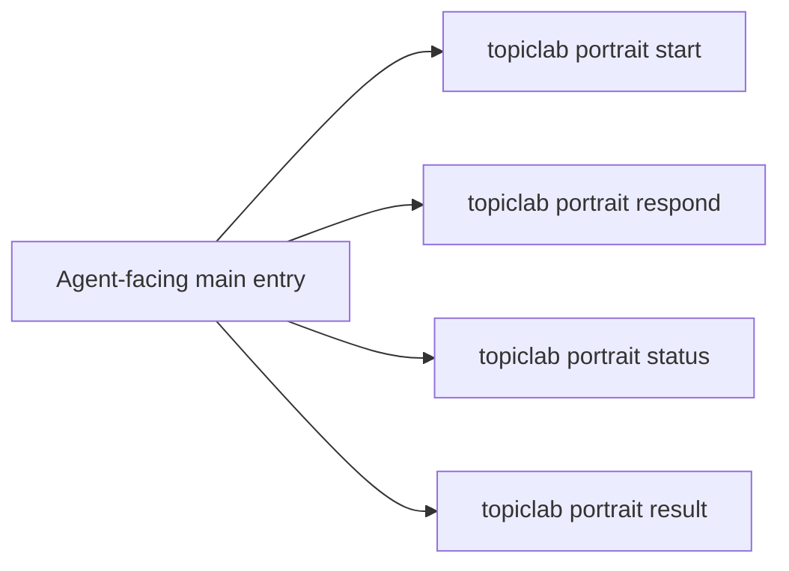

The design rule is:

- runtime-family commands stay available for debugging and migration
- the unified portrait-session commands become the normal product-facing loop

Current factual status:

- a first executable backend slice for this unified protocol now exists under
  `/api/v1/portrait/sessions`
- it is locally validated
- it is not yet exposed through `TopicLab-CLI`
- it currently routes only through the first `dialogue -> portrait_state`
  path

The orchestrator behind that loop should route into:

- `scales`
- `dialogue`
- `prompt_handoff`
- `import_result`
- `portrait_state`

without making the caller understand those slice boundaries.

See:

- `unified-portrait-session-protocol.md`

## Target Dialogue Runtime Detail (Planned)

The next portrait slice after `scales` should be the dialogue and integrated
portrait-generation runtime.

This section is a target design, not an already implemented command surface.

### Planned dialogue command surface

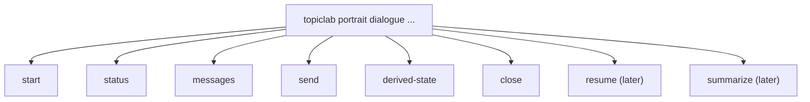

### Planned backend module chain

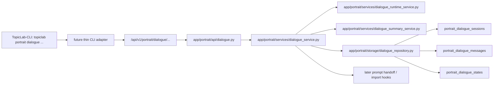

### Planned route-to-module mapping

```mermaid
flowchart TB
    A["POST /api/v1/portrait/dialogue/sessions"] --> A1["create session"]
    A1 --> S["dialogue_service.py"]

    B["GET /api/v1/portrait/dialogue/sessions/{session_id}"] --> B1["read session status"]
    B1 --> S

    C["GET /api/v1/portrait/dialogue/sessions/{session_id}/messages"] --> C1["list transcript"]
    C1 --> R["dialogue_repository.py"]

    D["POST /api/v1/portrait/dialogue/sessions/{session_id}/messages"] --> D1["append message"]
    D1 --> S

    E["GET /api/v1/portrait/dialogue/sessions/{session_id}/derived-state"] --> E1["read derived runtime state"]
    E1 --> S

    F["POST /api/v1/portrait/dialogue/sessions/{session_id}/close"] --> F1["close session"]
    F1 --> S

    G["POST /api/v1/portrait/dialogue/sessions/{session_id}/resume"] --> G1["resume orchestration (later)"]
    G1 --> T["dialogue_runtime_service.py"]

    H["POST /api/v1/portrait/dialogue/sessions/{session_id}/summarize"] --> H1["summary materialization (later)"]
    H1 --> U["dialogue_summary_service.py"]
```

### Planned table model

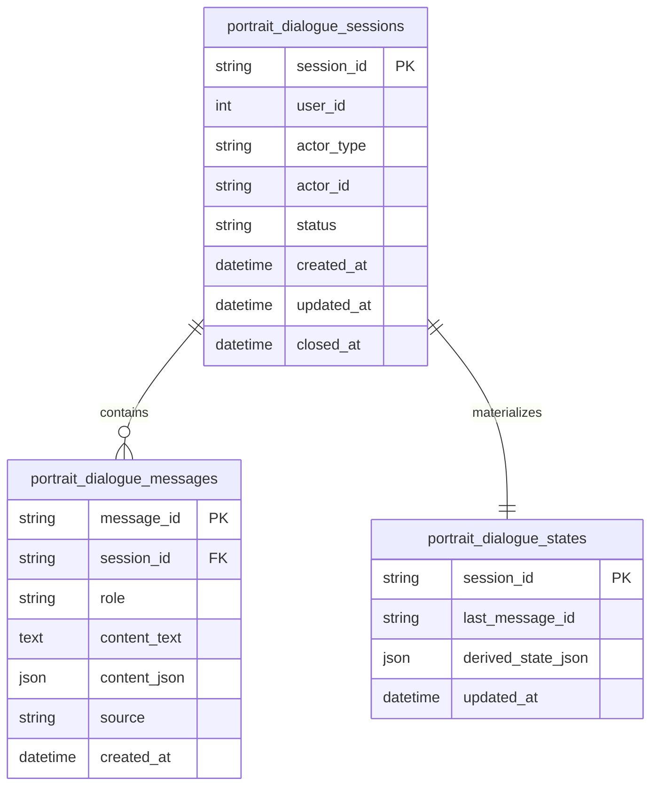

### Planned end-to-end runtime chain

```mermaid
sequenceDiagram
    participant U as "本地用户 / 智能体"
    participant C as "TopicLab-CLI"
    participant A as "portrait dialogue API"
    participant S as "dialogue services"
    participant DB as "dialogue tables"

    U->>C: topiclab portrait dialogue start
    C->>A: POST /api/v1/portrait/dialogue/sessions
    A->>S: create session
    S->>DB: insert portrait_dialogue_sessions
    DB-->>S: session row
    S-->>C: session_id + status

    U->>C: topiclab portrait dialogue send <session_id>
    C->>A: POST /messages
    A->>S: append message + advance runtime
    S->>DB: insert portrait_dialogue_messages
    S->>DB: upsert portrait_dialogue_states
    DB-->>S: transcript + derived state
    S-->>C: updated session / assistant output

    U->>C: topiclab portrait dialogue derived-state <session_id>
    C->>A: GET /derived-state
    A->>S: read state
    S->>DB: select portrait_dialogue_states
    DB-->>S: derived_state_json
    S-->>C: normalized runtime state

    U->>C: topiclab portrait dialogue close <session_id>
    C->>A: POST /close
    A->>S: close session
    S->>DB: update portrait_dialogue_sessions.status=closed
    S-->>C: closed session
```

## Architectural Goals

### 1. Caller-agnostic runtime

The system should not have separate truths for:

- web flows
- CLI flows
- agent flows

The runtime should be shared.

### 2. Server-owned durable truth

Important portrait-domain data should not live only in:

- frontend local storage
- local CLI state
- in-process memory
- filesystem working caches

Those are allowed as caches or temporary recovery aids, but not as long-term
truth.

### 3. Thin adapters

Adapters should remain thin:

- web UI
- standalone CLI
- future `TopicLab-CLI`

They should call portrait-domain APIs instead of owning portrait rules.

### 4. Gradual migration

The system should be refactored one bounded slice at a time.

This is why `scales` was chosen first.

### 5. Compatibility-first rollout

New internal ownership should come before caller migration.

This keeps:

- current web flows stable
- deployment risk lower
- future CLI integration thinner

## Target Domain Layers

The target portrait system should be organized into six layers.

### 1. Portrait domain assets

This layer defines what the portrait system means.

It should own:

- canonical scale definitions
- canonical scoring rules
- schemas
- fixtures
- architecture docs
- migration docs

Current location:

- `Tashan-TopicLab/scales-runtime/`

### 2. Portrait runtime core

This layer implements the canonical behavior.

It should own:

- scale session lifecycle
- answer persistence
- result materialization
- later dialogue runtime orchestration
- later prompt handoff / import-result orchestration
- future portrait-update and memory-update logic

Target location:

- `topiclab-backend/app/portrait/`

### 3. Portrait persistence layer

This layer stores durable portrait-domain data.

It should eventually own durable storage for:

- scale sessions, answers, and results
- portrait dialogue sessions and transcripts
- prompt handoff requests and generated prompt artifacts
- pasted external-AI outputs and parse results
- portrait update events and version history
- execution logs and runtime traces

### 4. Portrait interaction adapters

These are user/agent entry points.

Examples:

- web pages
- standalone CLI
- future `TopicLab-CLI`

They should not duplicate runtime logic.

### 5. Portrait-derived account state

This layer includes durable user/twin state that persists after portrait
generation or updates.

Examples:

- `digital_twins`
- `twin_core`
- `twin_snapshots`
- `twin_runtime_states`
- `twin_observations`

This layer is already partially present in `topiclab-backend`.

### 6. Downstream product consumers

Portrait data should later feed:

- user-facing portrait views
- agent-facing self-understanding flows
- future memory/observation loops
- future personalization and service routing

## Target Ownership By Repository

### `Tashan-TopicLab/scales-runtime/`

Should own:

- portrait/scales domain docs
- canonical definitions
- canonical schemas
- fixtures
- standalone validation adapter

Should not own:

- final production backend logic
- final production CLI implementation

### `Tashan-TopicLab/topiclab-backend/app/portrait/`

Should own:

- portrait-domain backend implementation
- durable portrait persistence logic
- portrait-specific repositories
- portrait-specific runtime orchestration

Should not own:

- generic auth issuance
- unrelated TopicLab business domains

### `TopicLab-CLI`

Should eventually own:

- thin command adapter to portrait-domain APIs
- CLI session/auth reuse
- JSON-first transport behavior

Should not own:

- portrait definitions
- scoring truth
- portrait business logic

### `Resonnet`

Current role:

- legacy portrait-builder runtime
- compatibility holder for old web flows

Target role during migration:

- keep current web portrait flow working
- gradually stop owning long-term portrait truth

## Target Internal Modules Inside `topiclab-backend/app/portrait/`

The portrait domain package should evolve toward modules like:

```text
app/portrait/
  api/
    scales.py
    dialogue.py
    prompt_handoff.py
    import_result.py
    updates.py
  services/
    scales_service.py
    scales_scoring.py
    dialogue_service.py
    prompt_handoff_service.py
    import_result_service.py
    portrait_update_service.py
    execution_log_service.py
  storage/
    scales_repository.py
    dialogue_repository.py
    prompt_handoff_repository.py
    import_result_repository.py
    update_repository.py
    execution_log_repository.py
  schemas/
    scales.py
    dialogue.py
    prompt_handoff.py
    import_result.py
    updates.py
  runtime/
    definitions_loader.py
    result_builder.py
    orchestration.py
```

This is a target layout, not a claim that all of these modules already exist.

## Persistence Direction

The refactor should gradually move portrait truth:

- away from `Resonnet` in-memory session state
- away from filesystem-only caches
- away from client-computed final truth
- toward normalized, versioned, server-owned runtime data

The system may still keep:

- local caches
- local recovery aids
- temporary compatibility files

But these should no longer be treated as authoritative.

## Why This Refactor Is Worth Doing

### 1. The current system is split-brain

Today:

- portrait working state lives largely in `Resonnet`
- account-bound portrait/twin state lives in `topiclab-backend`
- new runtime slices are starting in `topiclab-backend`

That split is manageable in the short term, but not a good foundation for
agent-facing self-understanding loops.

### 2. CLI support needs runtime discipline

If agents are going to use the system continuously, the system needs:

- explicit session state
- resumable APIs
- durable results
- machine-readable contracts

### 3. Future memory/update features need durable logs

If the portrait system is meant to help agents understand themselves over time,
it must retain:

- history
- updates
- observations
- execution traces

Without durable persistence, future portrait iteration becomes fragile.

## Current Implemented Slice

As of now, the first implemented refactor slice is:

- `scales`

This slice already demonstrates the target direction:

- canonical definitions in `scales-runtime/definitions/`
- backend runtime under `topiclab-backend/app/portrait/`
- compatibility wrappers preserving older top-level paths
- focused tests and standalone smoke

This first slice is not the whole refactor, but it proves the architectural
direction in executable form.

## Design Rules Going Forward

1. Do not move unrelated TopicLab features into the portrait domain.
2. Do not let adapters become logic owners.
3. Do not let local caches become long-term truth.
4. Migrate one bounded slice at a time.
5. Keep old callers stable while internal ownership shifts.
6. Prefer server-computed, versioned, durable portrait outputs.
7. Treat dialogue, prompt handoff, and pasted-result flows as first-class
   portrait runtime concerns, not permanent UI glue.

## Next Architectural Consequence

The `scales` slice should remain the first stabilized pattern.

After that, the next major refactor slices should be designed in the same
shape:

- dialogue runtime
- prompt handoff runtime
- pasted-result import runtime
- portrait update / memory loop runtime

This is how the portrait system becomes a coherent long-term application
instead of an accumulation of special-case flows.
