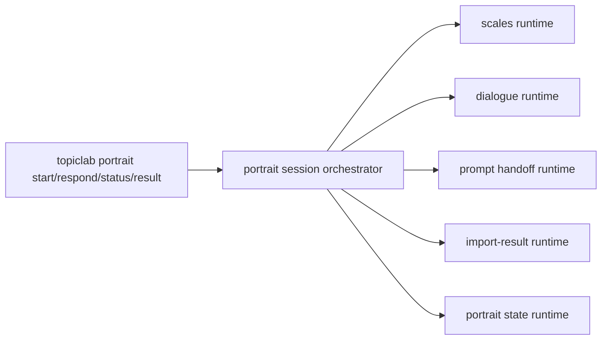
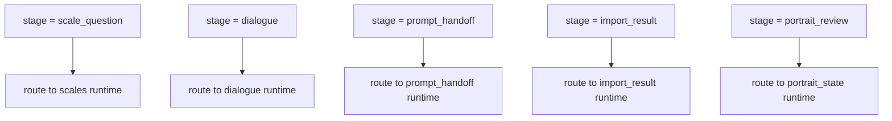
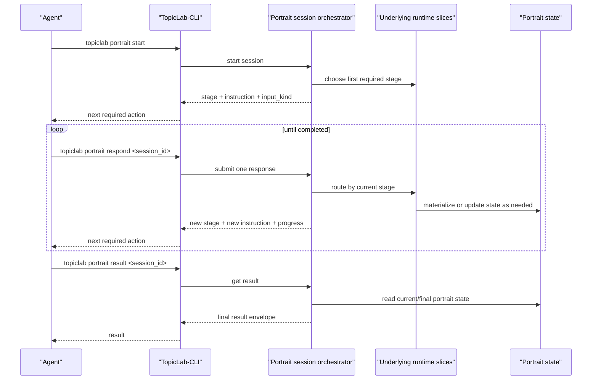

# Unified Portrait Session Protocol

## Purpose

This document defines the target **agent-facing main entry protocol** for the
portrait system.

It exists because the portrait backend is naturally decomposing into multiple
runtime slices:

- `scales`
- `dialogue`
- `portrait_state`
- `prompt_handoff`
- `import_result`

Those slices are useful backend boundaries and useful debugging surfaces, but
they are **not** the right primary mental model for an agent caller.

For an agent, the product should feel like one resumable portrait session:

1. the system tells the agent what to do next
2. the agent submits one response
3. the system returns the new state and next instruction

## Core Design Position

There should be two CLI layers.

### 1. Runtime-family command layer

These commands stay available for debugging, testing, migration, and internal
operations.

Examples:

- `topiclab scales ...`
- `topiclab portrait dialogue ...`
- `topiclab portrait state ...`
- future `topiclab portrait prompt ...`
- future `topiclab portrait import ...`

### 2. Unified portrait session layer

This is the **main entry** an external agent should use.

Minimal target surface:

- `topiclab portrait start`
- `topiclab portrait respond [session_id]`
- `topiclab portrait status [session_id]`
- `topiclab portrait result [session_id]`

Current user-flow control extensions now already proven useful:

- `topiclab portrait resume [session_id]`
- `topiclab portrait history`
- `topiclab portrait reset [session_id]`
- `topiclab portrait export [session_id]`

## Current Executable Status

The protocol is no longer paper-only.

Today there is already a first executable backend batch behind:

- `POST /api/v1/portrait/sessions`
- `GET /api/v1/portrait/sessions/{session_id}`
- `POST /api/v1/portrait/sessions/{session_id}/respond`
- `GET /api/v1/portrait/sessions/{session_id}/result`

That executable batch currently routes:

- `respond(text)` -> `dialogue` -> `portrait_state`
- `respond(choice="scale:<id>")` -> `scales` -> `portrait_state`
- `respond(choice="prompt_handoff")` -> `prompt_handoff`
- `respond(external_text|external_json)` -> `import_result` -> `portrait_state`
- `respond(confirm)` -> completes the top-level portrait session

The backend truth for this batch currently lives in:

- `portrait_sessions`
- `portrait_session_runtime_refs`
- `portrait_session_events`

The first executable main-entry loop has also now been validated through the
AutoDL public HTTPS staging URL via `TopicLab-CLI`, without SSH tunneling.

That public validation now also includes the first user-control commands above:

- `resume`
- `history`
- `reset --restart`
- `export`

## Why This Layer Is Needed

Humans do not experience the portrait product as many separate backend modules.

They experience a guided loop:

- choose an option
- type something into a box
- see the system's feedback
- see the next required action

The agent-facing CLI should mirror that same structure.

The agent should not need to decide:

- whether the next step belongs to `scales`
- whether it should call `dialogue`
- whether a prompt handoff is required
- whether an import parse must be applied to portrait state

That routing belongs on the server.

## Target Command Semantics

### `topiclab portrait start`

Starts or resumes a unified portrait session.

It should:

- create a new top-level portrait session if none exists
- return the first stage
- return the first system instruction
- return what input is required next

Suggested options:

- `--actor-type <type>`
- `--actor-id <id>`
- `--mode <default|fast|deep>`
- `--resume-latest`
- `--json`

### `topiclab portrait respond <session_id>`

Submits exactly one step of input to the portrait session.

This is the main working command.

The command should accept one of the following input families:

- choice answer
- free text
- external AI pasted result
- explicit continue/confirm signal

Suggested options:

- `--choice <value>`
- `--text <text>`
- `--text-file <path>`
- `--external-text <text>`
- `--external-file <path>`
- `--external-json <json>`
- `--external-json-file <path>`
- `--confirm`
- `--json`

Only one input family should be used per call.

In the current executable CLI surface, `[session_id]` is optional when a local
current portrait session has already been remembered in CLI state.

### `topiclab portrait status <session_id>`

Returns the full current session snapshot.

It should support:

- interruption recovery
- long-running agent workflows
- later thread continuation

### `topiclab portrait result <session_id>`

Returns the current or final portrait result view.

If the session is incomplete, it should still return:

- current portrait state
- completed components
- remaining steps

### `topiclab portrait resume [session_id]`

Returns an active or latest portrait session without forcing the caller to
manually inspect lower-level runtime IDs.

### `topiclab portrait history`

Returns recent top-level portrait sessions and, when requested, related
portrait-state versions or observations.

### `topiclab portrait reset [session_id]`

Resets the current portrait-creation process. In the current executable CLI
surface it can also request an immediate restart into a fresh top-level session.

### `topiclab portrait export [session_id]`

Reads the current portrait result and writes a local export artifact such as
JSON or Markdown.

## Response Envelope

Every unified-session command should return one stable response envelope.

Suggested shape:

```json
{
  "session_id": "pts_xxx",
  "status": "active",
  "stage": "scale_question",
  "message": "请回答 RCSS 第 3 题。",
  "input_kind": "choice",
  "allowed_actions": ["respond", "status", "result"],
  "payload": {
    "question_id": "rcss_q3",
    "scale_id": "rcss",
    "choice_range": [1, 7]
  },
  "progress": {
    "completed_steps": 4,
    "total_steps_estimate": 16
  },
  "result_preview": null,
  "next_hint": "请输入 1 到 7 的整数。"
}
```

## Input Kind Contract

The top-level orchestrator should normalize all next-step requests into a small
set of input kinds.

Recommended stable values:

- `choice`
- `text`
- `external_result`
- `confirm`
- `none`

This keeps the agent-side loop simple.

The first executable backend batch is still slightly more permissive in its
returned next-step vocabulary. It currently emits:

- `text`
- `choice`
- `text_or_choice`
- `external_text_or_json`
- `none`

That is acceptable for early execution, but the long-term contract should still
converge toward the smaller stable set above.

## Stage Contract

The top-level orchestrator should surface the current stage explicitly.

Recommended stable values:

- `intro`
- `scale_question`
- `dialogue`
- `prompt_handoff`
- `import_result`
- `portrait_review`
- `completed`
- `blocked`

These stage names are not backend implementation details. They are part of the
agent-facing contract.

## Orchestration Model

The unified session layer should route each step into an existing runtime
family, not replace those families.



### Stage-to-runtime routing



## End-to-End Session Loop



## Backend Modules Needed

The unified session protocol should not be implemented directly inside
`TopicLab-CLI`.

It should be implemented in `topiclab-backend/app/portrait/`.

Suggested backend module chain:

- `app/portrait/api/session.py`
- `app/portrait/services/portrait_session_service.py`
- `app/portrait/services/portrait_orchestration_service.py`
- `app/portrait/storage/portrait_session_repository.py`
- `app/portrait/schemas/session.py`

Suggested responsibilities:

- create top-level portrait sessions
- determine next required step
- route responses into slice runtimes
- normalize all outputs into one response envelope
- materialize portrait state when downstream slices produce new information

## Suggested Tables

The unified protocol should add a top-level orchestration layer above the slice
tables.

Suggested durable tables:

- `portrait_sessions`
- `portrait_session_runtime_refs`
- `portrait_session_events`

Suggested minimum responsibilities:

- `portrait_sessions`
  - top-level user-visible session lifecycle
- `portrait_session_runtime_refs`
  - links to:
    - `scale_session`
    - `dialogue_session`
    - `handoff_id`
    - `import_id`
    - `portrait_state_id`
- `portrait_session_events`
  - append-only normalized event log for:
    - prompts shown
    - responses submitted
    - state transitions
    - errors / blocked conditions

## Relationship To Current Slice Commands

The current slice commands should remain.

They are still valuable for:

- focused debugging
- tests
- migration staging
- operator investigation

But they should become **secondary surfaces**, not the main mental model for an
agent caller.

The recommended product-facing rule is:

- agents use `topiclab portrait start/respond/status/result`
- user-facing control stays in `resume/history/reset/export`
- engineers can still use `scales`, `dialogue`, `state`, and later
  `prompt/import` commands when they need lower-level control

## Migration Plan

Recommended migration order:

1. keep existing slice commands working
2. implement backend `portrait session orchestrator`
3. add `topiclab portrait start/respond/status/result`
4. internally route those commands through the existing runtime slices
5. only later decide whether some lower-level commands can be hidden from the
   default user docs

## Completion Criteria

This unified protocol should be considered ready when:

1. an agent can complete a whole portrait flow without knowing slice names
2. every response includes next-step requirements in machine-readable form
3. interruption recovery works through `status`
4. final or current portrait state is always readable through `result`
5. the server, not the CLI, owns the routing logic between portrait slices
